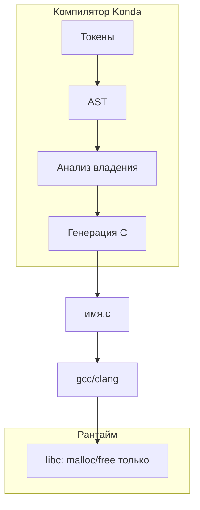

# Архитектура транспилятора Konda → C

Документ описывает **целевую** архитектуру: как развить текущий транспилятор до генератора обычного C **без собственной рантайм-библиотеки**, где освобождение памяти, «подсчёт ссылок» и проверки границ массивов выполняются **на этапе компиляции** и выражаются явными вызовами `malloc` / `free` и условиями в сгенерированном коде.

> **Где мы сейчас.** Транспилятор построен на **трёхпроходном конвейере с AST**: `разбор.c` (токены → AST), `семантика.c` (таблица символов, области видимости, проверка границ, типы, владение срезами, элиминация лишних проверок) и `кодоген.c` (AST → C). Весь конвейер собран в разделяемую библиотеку **libkonda** (`Собранное/libkonda.so`) с единым публичным заголовком `konda.h`; CLI `Транспилятор` — тонкая обёртка. Реализованы: срезы `срез<T>` с защитой от переполнения, массивы фиксированного размера, autofree и перемещение владения (RAII в стиле Vala — без рантайма), деструкторы структур `[удалить = …]` с транзитивной деструкцией полей-структур, перечисления (`перечисление Имя { … }` → `typedef enum`) с `выбор`/match и проверкой исчерпываемости, логические операторы `и`/`или` (→ `&&`/`||`, приоритет как в C; `и` — контекстное ключевое слово, остаётся валидным именем переменной; принимается и C-запись `&&`/`||`), явное приведение `как<тип>(…)` с запретом неявного сужения (результат смешанной арифметики типизируется по старшему операнду, `целое8 + целое64 → целое64`, поэтому усечение суммы в целое32 ловится), интерполяция строк (f-строки в стиле Swift: `"…\(выр)…"` → `snprintf` в буфер на стеке в начале функции, не `static` — потокобезопасно; быстрый путь `"\(строка)"` без буфера), **символьные литералы** `'x'` (узел `УЗЕЛ_СИМВОЛ`, тип `символ`/`char`; escape как в C; лексер собирал `ТОКЕН_СИМВОЛ` и раньше — добавлены парсер/семантика/кодоген, эмит дословно), **строки как `срез<символ>`** (§37; алиас-имя `строка` — контекстное, не отнимает имя-переменную. Реализованы: (1) литерал → заимствованный срез над `.rodata` `(Срез){(void*)"лит", sizeof("лит")-1}`, длина в байтах UTF-8, NUL сохранён — совместимость с `printf`; (2) коэрция литерала/f-строки на call-site и в присваивании — с guards на владеющую цель, `владеет`-параметр, возврат литералом; (3) владеющие строки через `выделить(N)` и f-строки в срез-контексте — snprintf в стек-буфер + Срез; (4) `вкси(с)` → `символ*` — zero-cost для литералов/f-строк (флаг `с_нулем`, эмит `.данные`), копия+NUL в стек-буфер для прочих; (5) возврат заимствованных строк (п.6): свойство «функция возвращает заимствованный срез» ВЫВОДИТСЯ пред-проходом `вывести_владение_возврата` (аналог `вывести_чистоту`, fixpoint), хранится в сигнатуре и в `.и` (`Ф имя <бит>`), переносится на call-узел; кодоген на `срез с = ф()` регистрирует autofree только для владеющих — фабрика литералов `строка код(){ вернуть "OK" }` не аллоцирует/не free'ит, ноль рантайма; смешанный возврат — ошибка. Не покрыто: конкатенация, подстроки, `==`, юникод-итерация — операции пойдут в stdlib), **режим сборки отладка/релиз** (`--релиз`: снимаются только арифметические guard'ы переполнения/деления/сдвига, `cc -O2`; **проверки границ срезов/массивов/argv остаются** — безопасность памяти как в Rust; по умолчанию отладка со всеми проверками и `-O0 -g`; статический анализ одинаков в обоих), **сборка библиотеки** (`--библиотека`: `.so` через `-shared -fPIC` без точки входа + публичный заголовок `.h` с типами и прототипами не-`статический` функций — `кодоген_заголовок`), запуск `cc` через `execvp` с готовым argv вместо `system()` со строкой (закрыт command injection через имя входного файла), исправлена транзитивная деструкция структур: предел глубины рекурсии теперь равен числу объявленных структур (а не фиксированной константе 16) — раньше на вложенности глубже 16 уровней деструктор молча не эмитился (тихая утечка ресурса), статические UB-проверки операторов (сдвиг/переполнение/деление) с рантайм-guard для неконстантных случаев в отладке — деление/остаток на ноль, сдвиг вне разрядности и знаковое переполнение `+/-/*` (checked-builtin в стиле Rust; беззнаковый перенос не проверяется, он определён в C), строки-литералы только для чтения, запрет decay массива в сырой указатель, статическая защита от деления на ноль и устранение избыточных проверок границ. Добавлены: защита парсера от переполнения стека на патологически сложных выражениях (лимит «единиц работы» на выражение с понятной диагностикой вместо segfault), CLI-диагностика (`--version`, отклонение неизвестных `--флагов`, понятная ошибка при отсутствии `точка_входа` до вызова `cc`), многофайловый сбор имён перечислений (паритет со структурами — `ИменаПеречислений`/`собрать_имена_перечислений`), **возврат структуры/перечисления из функции по значению** (перечисление — свободно; структура — только если ей не нужна деструкция, иначе явная ошибка вместо рискованной move-семантики возврата), **`срез<T>` как поле структуры** (структура — единственный владелец, инициализация только `выделить`/`клон` в литерале полей, autofree поля при выходе структуры из области, запрет копирования/передачи/возврата по значению и запрет «увода» среза из поля в отдельную переменную). **видимость функций из C-библиотек и IDE-интеграция**: `заголовки.c` сканирует подключённые `#содержит`-заголовки (эвристический разбор прототипов + обход вложенных `#include`, `собрать_внешние_функции`) — транспилятор «видит» `printf`/`strlen`/… и диагностирует вызов необъявленной функции предупреждением уровня Konda (с позицией в `.конда`) через `анализировать_полный`, а не делегирует всё компилятору C; поверх этого — стабильный IDE/LSP-API `libkonda_ide.c` (`konda_анализ` → диагностики + функции с сигнатурой/позицией + типы), анализ в памяти без файлов и без `cc`, для language server (подсветка, автодополнение, hover, goto-definition). **Батч-диагностика семантических ошибок**: семантика не останавливается на первой ошибке, а восстанавливается на границе оператора и функции (снимок/восстановление scratch-состояния анализатора, сброс области видимости) и собирает все ошибки за прогон — и CLI (`Всего ошибок: N`), и `konda_анализ` отдают список сразу, чтобы IDE подсветила все ошибки разом (парсер по-прежнему стоп-на-первой). **Тип `ничего` (void) и возврат по всем путям**: добавлен тип возврата `ничего` (→ C `void`), допустимый только в позиции типа возврата функции; при этом любая функция с непустым типом возврата обязана вернуть значение по всем путям — иначе ошибка семантики с позицией в `.конда` (fall-through в non-void функции C — UB, возврат мусора; ловим статически). Доказательство возврата — `все_пути_возвращают` в `владение.c` (рекурсивно: `вернуть`; `если/иначе` с возвратом в обеих ветвях; исчерпывающий `выбор`; бесконечный `пока (1)`). Правило единое, `точка_входа` не исключение (в отличие от C, где `main` может неявно вернуть 0, Konda требует явного `вернуть 0`). **Полнота базовых типов и управления**: добавлены `вещественное64` (→ C `double`; в смешанной арифметике доминирует над `вещественное`, оба — над целыми), `логический` (→ C23 `bool`) с литералами `истина`/`ложь` (→ `true`/`false`, годны как тип возврата/переменной/условия), и операторы управления циклом `прервать`/`продолжить` (→ `break`/`continue`) с семантической проверкой «вне цикла» (по счётчику `глубина_цикла`), **цепочки `иначе если`** (`разобрать_если` при `иначе`, за которым идёт `если`, оборачивает вложенный `если` в синтетический `УЗЕЛ_БЛОК` — форма ветви «иначе» остаётся блоком, поэтому анализ владения/путей, `все_пути_возвращают` и кодоген не меняются; в C выходит `else { if … }`, тождественно `else if`). `прервать` учтён и в `все_пути_возвращают`: `пока (истина)` считается расходящимся только если в его теле нет привязанного к этому циклу `прервать`. Каждая новая лексема — сквозной срез изменений (лексер → парсер → семантика → кодоген → IDE-hover); статус-ловушка парсера: токен, которым может ЗАКАНЧИВАТЬСЯ оператор (`прервать`/`продолжить`/`истина`/`ложь`), обязан быть в `токен_завершает_оператор`, иначе перевод строки после него гасится как продолжение. **Обобщённые функции (generics) через мономорфизацию**: `обобщения.c` — отдельный AST→AST проход `мономорфизировать`, встроенный МЕЖДУ разбором и семантикой (в CLI `основа.c` и IDE `libkonda_ide.c`), так что семантика/кодоген работают с полностью конкретным деревом и никогда не видят тип-переменную. Синтаксис `T имя<T>(T а)` с явными тип-аргументами на вызове `имя<целое32>(…)`. Парсер: пред-проход `собрать_типопараметры` по глубине фигурных = 0 распознаёт имена тип-параметров (и имена самих обобщённых функций — для дизамбигуации `<` тип-аргументов от оператора сравнения); тип-параметр представлен маркером `ТОКЕН_ТИПОПАРАМЕТР` (имя в `имя_типа`), тип-параметры функции — ведущими детьми `УЗЕЛ_ТИПОПАРАМЕТР`, тип-аргументы вызова — ведущими детьми `УЗЕЛ_ТИПОАРГУМЕНТ`. Драйвер: для каждого уникального вызова клонирует шаблон (`узел_копировать` — новая глубокая копия AST), подставляет тип-параметры на конкретные типы, снимает `УЗЕЛ_ТИПОПАРАМЕТР`, даёт специализации сгенерированное имя (`максимум_целое32`, хранится в новом поле `Узел.собственное_имя` — владеющая строка, освобождается/дублируется вместе с узлом), переписывает вызовы; ворклист обрабатывает транзитивные и рекурсивные вызовы, дедуп по имени специализации. Шаблоны удаляются из программы (как невыведенные шаблоны C++). Ошибки уровня Konda: арность тип-аргументов, неизвестный шаблон. **Обобщённые структуры** обслуживает тот же проход: `структура Пара<T> { … }` собирается в отдельную таблицу шаблонов-структур; в позиции типа (объявление/параметр/поле/возврат) `Пара<целое32>` парсится как узел-носитель типа с ведущими `УЗЕЛ_ТИПОАРГУМЕНТ` (парсер: `разобрать_тип_аргументы_типа` после `съесть_именованный_тип`; `начинается_объявление_типа` распознаёт `Имя<…>` как объявление только для известной обобщённой структуры). Порядок фаз важен: сперва мономорфизация функций (подстановка `T` заходит и внутрь `УЗЕЛ_ТИПОАРГУМЕНТ`, так что `Пара<T>` в теле/параметрах специализации становится `Пара<целое32>`), затем фаза структур обходит все конкретные ссылки, порождает специализацию (`Пара_целое32`, `Пара_символ_у`), снимает тип-параметры/тип-аргументы, переписывает ссылку через owned-строку `имя_типа_строка`; свой ворклист покрывает транзитивные поля-структуры. Специализации структур добавляются перед функциями (кодоген всё равно печатает типы отдельным проходом раньше функций). Поля v1 — примитивы/указатели/структуры (`срез<T>`-поле обобщённой структуры отвергается парсером — отдельная итерация, чтобы обобщения не пересекались с autofree/деструкцией). Ошибка уровня Konda: арность тип-аргументов структуры (с позицией `имя_типа`). **Вывод тип-аргументов** (`макс(1,2)` ≡ `макс<целое32>(1,2)`) сделан ГИБРИДОМ: перед мономорфизацией запускается `вывести_типоаргументы` (семантика.c) — отдельный проход в `режим_вывода`, который типизирует аргументы обобщённых вызовов ТЕМ ЖЕ `типизировать_выражение` и, если каждый тип-параметр выводится из «голого»-`T` параметра с КОНКРЕТНЫМ типом аргумента, дописывает ведущие `УЗЕЛ_ТИПОАРГУМЕНТ` на узел вызова (короткое замыкание `вывести_обобщённый_вызов` в ветке `УЗЕЛ_ВЫЗОВ`); дальше мономорфизация видит их как явные. Проход — best-effort: диагностики подавлены (`ошибка_семантики`/`предупреждение_семантики` — no-op при `режим_вывода`), обход тел не-шаблонных функций плоский (`вывод_обход`: область не выталкивается — на точность вывода влияет лишь консервативно, корректность даёт настоящий анализ ниже). Три подводных камня, из-за которых нельзя было просто прогнать полный анализ дважды и которые закрыты: (1) `типизировать_выражение` пишет КОДОГЕН-ПОДСКАЗКИ на узлы (`проверка_бинопа`, `безопасный_индекс`, `проверка_аргументов`) — при `режим_вывода` символы без `значение_известно`, подсказка была бы ложной и пережила бы до кодогена (настоящий проход её не сбрасывает), поэтому эти записи гейтятся `!режим_вывода`; (2) `подготовить_оператор` МУТИРУЕТ токен оператор-функции (манглинг не идемпотентен) — оператор-функции в `режим_вывода` пропускаются; (3) `подставить` (обобщения.c) копировал `имя_типа` мелко (Токен-указатель) — у ВЫВЕДЕННОГО тип-аргумента имя лежит в owned-строке узла-аргумента, который мономорфизация вскоре освобождает → висячий указатель в имени специализации; теперь имя структуры/перечисления копируется ГЛУБОКО (`strndup` в `имя_типа_строка` клона). Охват v1 (решение пользователя): вывод ТОЛЬКО из конкретных аргументов; аргумент, чей тип сам зависит от неразвёрнутого обобщения (поле обобщённой структуры, переменная обобщённого-структурного типа — `ОписаниеСтруктуры.обобщённая`), считается неконкретным → нужны явные `<>`. Невыводимый вызов без `<>` даёт понятную ошибку в мономорфизации («нельзя вызвать без тип-аргументов… укажите явно»), а не смутное «функция не объявлена». **Cross-file generics** работают, потому что `слить_программы` объединяет все файлы в одно дерево ДО мономорфизации/вывода — сам разворот шаблонов и вывод видят все шаблоны и вызовы независимо от файла. Единственный cross-file пробел был в ПАРСЕРЕ: пред-скан `собрать_типопараметры` (распознаёт имена обобщённых для дизамбигуации `<`) пер-файловый, поэтому файл-потребитель принимал `макс<целое32>(…)`/`Пара<целое32> п` за сравнение `<`. Закрыто по образцу `собрать_имена_структур`: набор `ИменаОбобщённых` (`собрать_имена_обобщённых` — паттерн «ИМЯ<» на глубине фигурных = 0, по всем файлам проекта) сидируется в `Разборщик.обобщённые` до `собрать_типопараметры` через новый вход `разобрать_с_именами_структур_обобщённых_батч` (старый `…_батч` — обёртка с nullptr, сигнатура цела; IDE однофайловый — nullptr, ему хватает своего пред-скана). Сбор имён идёт до разбора → порядок файлов не важен. **Безопасный указательный тип возврата (`Тип*`)**: парсер захватывает «*» после типа возврата в `функция->указатели`, кодоген эмитит их в заголовок и тело, сигнатура несёт `указатели_возврата` (чтобы вызов типизировался как `Тип*`). Безопасность — модель **borrow**: вернуть можно только указатель на память, которая переживёт возврат и принадлежит вызывающему/статике. Отслеживается флагом `Символ.безопасен_для_возврата` (borrow-провенанс): проставляется для указателей-параметров и `аргументы`, наследуется при копировании указателя, переприсваивается при `=` (закрывая дыру «безопасный→C-функция»), и **сливается по путям консервативно** (AND в `слить_снимки_пути`/`слить_цикл_путь` — безопасен, только если на всех путях). На `вернуть` проверка `выражение_безопасно_для_возврата` допускает только `нуль`, строковый литерал, borrow-безопасный указатель-переменную и индексацию такого; локальные массивы (decay уже запрещён отдельно), результаты C-функций (в т.ч. прямой `вернуть strchr(…)` при неизвестном типе) и всё прочее — ошибка. Так исключены висячие указатели и ручное управление памятью у вызывающего. **Союзы (union)**: `союз Имя { … }` — тот же аппарат, что у структур (узел `УЗЕЛ_СТРУКТУРА` с флагом `это_союз`; кодоген эмитит `typedef union` вместо `struct`; распознавание имени и литерал — общие со структурой). Безопасность: **доступ к члену союза (`з.поле`) гейтится за `небезопасно`** (флаг `ОписаниеСтруктуры.это_союз`; активный член не отслеживается, чтение неактивного = type confusion; безопасная альтернатива — `перечисление`+`выбор`); поле-срез в союзе запрещено (владение неоднозначно — неизвестно, какой член активен) и деструктор `[удалить=…]` на союзе запрещён, поэтому союз никогда не требует autofree/деструкции. **Указатели на функцию**: именованный тип `типфункции RET Имя(типы)` → узел `УЗЕЛ_ТИПФУНКЦИИ` (токен — имя; тип возврата в полях узла; параметры — дети `УЗЕЛ_ПАРАМЕТР`), кодоген даёт `typedef RET (*Имя)(…);` (вся неуклюжесть C-синтаксиса указателя на функцию заперта в одном typedef). Тип переменной — маркер `ТОКЕН_ФУНКУКАЗАТЕЛЬ` (`имя_типа` — имя псевдонима, `Символ.индекс_структуры` — индекс в таблице `типыфункций`). Присваивание функции сверяет её сигнатуру (`сигнатура_совпадает_с_типфункцией`: возврат + типы параметров) с псевдонимом; вызов через указатель типизируется по псевдониму и проверяет не-нулёвость (`может_быть_нуль`) — вызов возможно-нулевого указателя — ошибка (крах в C). Имя функции как значение допускается только в позиции аргумента к параметру-указателю (иначе имя функции — не выражение); `ИнфоПараметра.индекс_структуры` несёт псевдоним параметра для проверки колбэков. **Параметры по ссылке `изменяемый`/`вывод` (C# ref/out)** — безопасная мутация переменной вызывающего без сырого `&`: флаг `по_ссылке` на `УЗЕЛ_ПАРАМЕТР` (1=ref, 2=out); семантика требует, чтобы аргумент был lvalue совпадающего типа (`изменяемый` — инициализированный до вызова, `вывод` — нет), а тело обязано присвоить каждый `вывод` **по всем путям** до возврата — проверка `проверить_вывод_присвоен` на каждом `УЗЕЛ_ВОЗВРАТ` и на fall-through конце тела, опираясь на путь-чувствительный флаг `Символ.инициализирована` (тот же, что ловит use-before-init). Кодоген передаёт такой параметр как `Тип*` (эмит `*` в заголовке), авто-разыменовывает использования в теле (`идентификатор_по_ссылке` → `(*имя)`) и ставит `&` перед аргументом на вызове (по `СигнатураК.по_ссылке`) — программист `&`/`*` не пишет, а ссылка не становится значением первого класса, поэтому выйти за вызов и повиснуть не может (borrow checker не нужен). Попутно исправлен латентный баг: void-функция без явного `вернуть` больше не получает неявный `return 0;` (ломало `-std=gnu23` для `ничего`-функций, что и вскрыли ref/out). **Пространства имён** `пространство Имя { … }` — чисто парсерная конструкция, сплющиваемая в программу с квалифицированными именами (семантика и кодоген видят плоский набор объявлений с `::` в именах, как раньше). Механика: `Разборщик` держит `текущее_пространство` (префикс объявлений) и список `импорты` (`использовать`); объявляемые имена квалифицируются через `собственное_имя` (для функций — плюс запись в набор `функции_пр` для резолва вызовов), а ссылки резолвятся при разборе — `разрешить_тип`/`разрешить_вызов` пробуют явное `A::B`, затем `текущее_пространство::имя`, затем импорты, затем глобаль (наборы имён типов хранят квалифицированные строки; квалифицированное имя типа оседает в новом owned-поле `Узел.имя_типа_строка`). Кодоген манглит `::` → `__` (в `имя_в_си` для идентификаторов/вызовов и `эмит_манглированное` для имён типов/typedef) — вся квалификация в C выражается плоским манглингом, нулевая рантайм-стоимость, как typedef'ы в C. Ограничения v1: один уровень, declaration-before-use для членов, обобщённые внутри пространства не поддержаны (пред-проход тип-параметров идёт по глубине скобок = 0), при конфликте импортов побеждает первый `использовать`. Дальнейшие этапы (косвенность в типе возврата функции, индексация поля-среза на месте) описаны ниже как известные ограничения, а не как ближайший план — каждое требует отдельного, более глубокого анализа (расширение AST-представления индекса для полей). **Усиление безопасности (последняя итерация)**: все сырые операции теперь за `небезопасно` — арифметика/индексация сырого указателя, реинтерпретация указателя к другому типу (type confusion), доступ к члену `союз`а, вызовы небезопасных функций libc (`strcpy`/`gets`/…); **ненулевые указатели по умолчанию** (`T*` нельзя присвоить `нуль`/оставить без инициализатора; nullable — `возможно<T*>` с разворотом под охранником `если (п != нуль)`/`== нуль … иначе`; добавлен оператор `!=`); **иммутабельность `конст`** (запрет переприсваивания/мутации/передачи в `изменяемый`); в релизе `-fwrapv` делает знаковое переполнение определённым (не UB) при нулевой цене; устранение проверки границ по охраннику `если (и < длина(с))` с беззнаковым `и` (быстрее без потери безопасности). Все проверки статические (нулевая рантайм-цена), детали — в §6.2.

---

## 1. Цели и ограничения

| Цель | Как достигается |
|------|-----------------|
| Autofree | Вставка `free` / освобождающих действий на всех выходах из области видимости |
| Нет утечек | Статический учёт владения; ошибка компиляции при неоднозначном владении |
| Проверка границ массивов | Обёртка массива + проверка индекса перед каждым доступом |
| Без рантайма | Нет `.a` / `.so`, нет глобального аллокатора, нет полей `refcount` в heap-объектах |
| «Подсчёт ссылок» | Анализ графа использований; компилятор знает **сколько раз** значение живёт и **куда** вставить копию или `free` |

Важно: речь не о динамическом reference counting в рантайме (как в Python или `shared_ptr` с атомиками), а о **статическом владении** (ownership), по смыслу близком к Rust, но с генерацией в C.

---

## 2. Конвейер (после токенизации)

Генерация идёт через AST (`разбор.c` → `семантика.c` → `кодоген.c`). Целевой порядок проходов:

```
исходник (.конда)
    → [готово] Лексер / токенизатор (МассивТокенов)
    → [готово] Условная компиляция (макросы.c): фильтр токенов по #if/#ifdef/…
    → Синтаксический анализ (рекурсивный спуск / Pratt) → AST
    → Семантика: типы, области, владение, размеры массивов
    → (опционально) упрощённый IR для анализа путей и владения
    → Генерация C + карта имён (кириллица → ASCII для C)
    → gcc/clang
```

Рекомендуемые модули в репозитории (логически, не обязательно отдельные файлы сразу):

- `разбор.c` — парсер, построение AST
- `семантика.c` — таблица символов, проверки типов и владения
- `владение.c` — граф использований, autofree, статический «refcount»
- `кодоген.c` — печать `.c` / `.h`
- `макросы.c` — безопасные макросы: **условная компиляция** над токенами до
  разбора (`условная_компиляция`). Директива `#…` лексится как один
  `ТОКЕН_ПРЕПРОЦЕССОР` (вся строка); проход держит стек кадров `#if` и удаляет
  токены неактивных веток и сами директивы `#if/#ifdef/#ifndef/#elif/#else/#endif/
  #define` (C-имена и русские: `#если/#опр/#не_опр/#иначе_если/#иначе/#конец/
  #определить`). `#содержит` и прочие `#` проходят как есть. Выражение `#if` —
  рекурсивный-спуск вычислитель целочисленных констант (`defined()`/`определён()`,
  макросы, `! - * / % + - сравнения && ||`, а также слова-операторы `не`/`и`/`или`).
  Флаги из CLI: `-D ИМЯ[=знач]`. **ПРЕДОПРЕДЕЛЁННЫЕ макросы** (`макросы_предопределить`,
  §40): режим сборки `дебаг`/`релиз`, ОС `линукс`/`макось`/`бсд`(+конкретные),
  архитектура `x86_64`/`арм64`/…, разрядность `бит64`/`бит32` — из триплета цели
  (кросс) или хоста (compile-time макросы + `sizeof(void*)`); `-D` их
  перекрывает. **Функциональных макросов и подстановки значений в код нет**
  (небезопасно; для констант — `конст`). Включён и в CLI (`основа.c`), и в IDE
  (`libkonda_ide.c`).
- `конвейер.c` — оркестрация и диагностики

Разбор в AST (`разбор.c`) отделён от генерации текста (`кодоген.c`); между ними — проход семантики (`семантика.c`). `конвейер.c` сейчас содержит только `очистка` (освобождение токенов и буфера исходника).

---

## 3. Модель памяти в языке

Чтобы компилятор мог доказать отсутствие утечек **без рантайма**, в Konda нужно явно разделить категории значений.

### 3.1. Категории

1. **Стек / примитивы** — `целое32`, `символ`, структуры без указателей на кучу: живут в области видимости, в C — локальные переменные.
2. **Уникальная куча (`владеет`)** — один владелец; при присваивании владение **перемещается** (move), старый путь становится недействительным.
3. **Заимствование (`&`)** — временная ссылка без передачи владения; не продлевается за пределы владельца (как в Rust, без полноценного borrow checker на первом этапе можно ограничить: «ссылка не переживает блок, где объявлен владелец»).
4. **Совместное использование без RC** — только если компилятор **статически** видит ровно N копий указателя с известным временем жизни; тогда вместо счётчика в памяти — **N явных `free`** в известных точках или **ровно одна** копия данных (остальное — заимствование).

На первом этапе проще всего: **только уникальное владение + заимствование**. Любая «вторая владельца» копия — либо явный `клон(...)` (глубокая копия + новый владелец), либо ошибка компиляции.

### 3.2. Что такое «статический подсчёт ссылок»

Компилятор для каждого значения с динамической памятью строит:

- **владелец** — переменная/поле, которая обязана вызвать освобождение;
- **число путей** — сколько раз значение передаётся (move / clone / borrow);
- **точки drop** — конец блока, `return`, `break`, `continue`, все ветки `если`.

«Счётчик ссылок» здесь — **целое в анализе компилятора**, не поле в структуре:

```
владеет строка* s = выделить(...);   // strong = 1
владеет строка* t = s;               // move: s недействителен, t strong = 1
клон(u, t);                          // t = 1, u = 1 (два владельца → два free в разных scope)
```

Если после анализа `strong > 1` без явного `клон` — **ошибка**: «значение используется после передачи владения» или «неоднозначное владение».

---

## 4. Autofree (RAII на этапе codegen)

### 4.1. Правило

Для каждой переменной с ресурсом компилятор регистрирует **destructor** (что вызвать при drop):

| Тип в Konda | Действие при drop |
|-------------|-------------------|
| `владеет T*` | `free(ptr)` или `free(ptr); free(wrapper)` |
| массив `владеет` | `free(данные)` |
| файл / сокет (если появятся) | `fclose` / `close` |

Вставка в C — в **все** точки выхода из scope:

- перед закрывающей `}` блока;
- перед каждым `return` с очисткой только **живых** в этой ветке переменных;
- в ветках `если` / `пока` — те же правила внутри вложенных блоков.

Порядок drop — **обратный** порядку объявления (как в C++ destructors).

### 4.2. Пример генерируемого C

Konda:

```конда
{
    владеет целое32* p = выделить(размер * sizeof(целое32));
    // ... использование ...
}
```

C:

```c
int32_t *p = (int32_t*)malloc((size_t)n * sizeof(int32_t));
if (!p) { /* обработка OOM по политике языка */ }
/* ... */
free(p);
```

При нескольких выходах:

```c
int32_t *p = malloc(...);
if (условие) {
    free(p);
    return 1;
}
free(p);
```

Компилятор **не** полагается на `atexit` и не генерирует общий `konda_drop_all()` — только локальные, предсказуемые вызовы.

### 4.3. Move и недействительные переменные

После `владеет B = A` (move) в анализе `A` помечается **moved**. Любое использование `A` — ошибка. В C генерируется присваивание указателя и **обнуление** или отдельный флаг не нужен, если move реализован как:

```c
b = a;
a = NULL;  /* опционально, для отладочных assert */
```

Drop для `a` не вставляется (владение ушло), drop для `b` — в конце scope.

### 4.4. Кастомный аллокатор (пер-тип; решение §30)

`аллокатор Имя { выделить = f  освободить = g }` объявляет свой распределитель;
`Ящик<T> в Имя` / `срез<T> в Имя` привязывают его к владеющему типу. `аллокатор`/`в` — **контекстные**
слова (парсер сверяет текст идентификатора; имена не отнимаются). Пул живёт во
**внешней памяти** (`f`/`g` обычно `внешняя` C: `целое8* f(целое64)`,
`ничего g(целое8*)`), поэтому инвариант №4 (нет изменяемых Konda-глобалов) цел —
изменяемое состояние в C/OS.

Кодоген (нулевая цена — прямые вызовы):

```
Ящик<T> в Имя б = выделить()   →   T *б = (T*)f(sizeof(T)); memset(б, 0, sizeof(T));
                                    /* autofree на выходе */  g((void*)б);
```

`memset` даёт паритет с `calloc` (свежий Ящик читается нулями). Таблица аллокаторов
(`алл_имя/алл_выделить/алл_освободить`) строится в `кодоген_и`; функция-освободитель
кладётся на запись стека владеющих (`освободить_владеющего[]`), и `эмит_освобождение`
печатает `g(...)` вместо `free`. Move переносит владение как обычно; получатель
несёт тот же аллокатор (семантика требует **равенства** имён аллокатора при move —
иначе `g` освободил бы память, выданную другим аллокатором → порча). Возврат Ящика
уже запрещён общим правилом (владеющий heap не `безопасен_для_возврата`), а
`владеет`-параметры — только для срезов, поэтому единственный move-путь Ящика —
локальная инициализация, и он закрыт проверкой равенства.

**Срез (`срез<T> в Имя`).** Та же машинерия владения/autofree/move/проверки границ,
что у обычного среза, но выделение/клон идут через сгенерированные пер-аллокатор
помощники `_срезвыд_<Имя>`/`_срезклон_<Имя>` (эмитятся `эмит_срез_помощники_
аллокаторов` после `#содержит`+прототипов — к этому моменту `f`/`g` объявлены;
только при `нужны_срезы`, иначе тип `Срез` не определён). Помощник повторяет
`срез_выделить`: guard переполнения `N*sizeof`, проверка неудачи аллокации,
`memset` (паритет с `calloc`). Autofree зовёт `g((void*)с.данные)`. **Стек-элизия
для кастомного среза отключена** (`собрать_стек_срезы` пропускает срез с
аллокатором — память обязана прийти из `f`). Cross-boundary передача владения
запрещена в v1 (аннотация аллокатора не переносится через сигнатуру): семантика
отвергает **возврат** такого среза, передачу в **`владеет`-параметр**,
инициализацию **вызовом функции** и **переприсваивание**; заимствование (обычный
срез-параметр, `длина`, индекс, `для_каждого`, `клон`-источник) — без ограничений.
Move — только между тем же аллокатором (равенство имён, как у Ящика).

---

## 5. Массивы и проверка границ

### 5.1. Представление в Konda и в C

Не генерировать «голый» `T[]` без длины. Внутреннее представление:

```c
typedef struct {
    int32_t *данные;
    size_t длина;
} Konda_Срез_целое32;
```

Для статически известной длины можно оптимизировать до `T arr[N]` **только** если анализ доказал, что индексы всегда `< N`, иначе — срез с `длина`.

### 5.2. Операции

| Операция | Генерация |
|----------|-----------|
| `a[i]` чтение | `konda_bounds_check(a.длина, i); a.данные[i]` |
| `a[i] = x` | то же |
| `длина(a)` | `a.длина` |

`konda_bounds_check` — **не** рантайм-библиотека, а **макрос или static inline** в сгенерированном заголовке одного файла (или встроенный `if` в каждую точку доступа):

```c
static inline void konda_bounds_check(size_t len, ptrdiff_t i) {
    if ((size_t)i >= len) {
        fprintf(stderr, "индекс %td вне [0, %zu)\n", i, len);
        abort();
    }
}
```

Политика ошибки: `abort()`, `exit(1)` или `__builtin_trap()` — на выбор, без аллокатора.

### 5.3. Константные индексы

Если `i` — литерал и известна `длина` при компиляции Konda, проверку можно **не генерировать** (оптимизация в pass «constant folding»).

### 5.4. Итерация

Цикл `для i : a` генерирует обход `0 .. a.длина-1` без пользовательского индекса — границы соблюдены по конструкции.

### 5.5. Бэктрейс при аварии (`конда_прервать`, `ПРОЛОГ_ПАНИКИ`)

Каждый guard (границы среза/массива/`аргументы`, деление на ноль, переполнение)
на пути отказа печатает своё сообщение, затем зовёт `[[noreturn]] конда_прервать`
— общий out-of-line хелпер: `backtrace()` + `backtrace_symbols_fd(2)` (пишет
прямо в fd=2, без `malloc` — надёжно при порче кучи) и `abort`. Определён в
`ПРОЛОГ_ПАНИКИ`, эмитится сразу после `ПРОЛОГ_ЗАГОЛОВКИ` (до всех guard-прологов).
Вынос в отдельную функцию (а не inline в каждый guard) держит тела проверок
крошечными → лучше инлайнится быстрый путь и меньше давит на I-cache.

**Цена на горячем пути — ноль:** трейс исполняется только при отказе, один раз,
перед `abort`. Раскрутка — по DWARF `.eh_frame`, поэтому `-fno-omit-frame-pointer`
**не** добавляется (иначе релиз потерял бы регистр). Читаемость обеспечивают
линк-флаги `-rdynamic`/`-funwind-tables`/`-g` (`скомпилировать_си`, параметр
`символы`) — они влияют **только на размер**, не на скорость, включены по
умолчанию и снимаются `--без-символов`. Полная символикация любого кадра —
`addr2line -e <exe> <адрес>` (работает благодаря `-g`). `execinfo.h` — glibc;
под `#if defined(__GLIBC__)`, иначе `конда_прервать` деградирует до `abort`
(переносимость для кросс-сборки).

### 5.6. Безопасность рекурсии (защита стека, TCO, предупреждение)

Глубокая рекурсия переполняет стек — последняя дыра memory-safety: сырой
`SIGSEGV`, а при большом кадре ещё и перепрыг сторожевой страницы с записью в
чужую память (UB). Три хода, все нулевой рантайм-цены (инвариант №1):

**(1) Защита стека (`ПРОЛОГ_ЗАЩИТЫ_СТЕКА`, кодоген).** Обработчик `SIGSEGV` на
*альтернативном* стеке (`sigaltstack` + `SA_ONSTACK` — работает, когда основной
стек исчерпан), ставится `__attribute__((constructor))` у любого исполняемого
файла (`программа_имеет_main`; в `.so`-библиотеке `main` нет → защиту ставит
финальная программа). Само переполнение ловит **аппаратная** guard-страница
ядра — ноль инструкций в обычной работе; обработчик лишь превращает
недетерминированный сбой в чистую панику `конда_прервать` (бэктрейс + `abort`).
Переполнение отличается от прочего `SIGSEGV` по адресу фолта: `si_addr` в
`[верх − RLIMIT_STACK − страница, верх]`, где `верх` захвачен в конструкторе
(`&локал`), а лимит — из `getrlimit(RLIMIT_STACK)` (без завязки на pthread →
работает на любой glibc). Прочий `SIGSEGV` (в safe-коде не бывает; только внутри
`небезопасно`) → `SIG_DFL` + `raise` → штатный core dump. Эмитится **после**
`ПРОЛОГ_ПАНИКИ` (использует `конда_прервать`), под `#if defined(__GLIBC__)`.
Следствие: `ПРОЛОГ_ПАНИКИ` теперь эмитится у **всех** исполняемых (раньше —
только при наличии guard'ов). *Ограничение v1:* точны границы главного потока;
переполнение в pthread-потоке падает дефолтным `SIGSEGV` — тоже безопасно
(guard-страница ловит), но без Konda-бэктрейса.

**(2) Гарантированный TCO (`КОНДА_ХВОСТ`, `МАКРО_ХВОСТ`, кодоген).** Хвостовая
само-рекурсия (`вернуть сам(...)`, где вызов — прямое значение возврата)
помечается макросом `КОНДА_ХВОСТ` = `[[clang::musttail]]` / `[[gnu::musttail]]`
(clang; gcc ≥ 15). Компилятор **обязан** превратить вызов в переход — иначе
ошибка компиляции; значит переполнения нет **по построению**, даже в отладке
(-O0). Если атрибут не поддержан, макрос ПУСТ → обычный вызов (корректность
цела, TCO просто нет). Эмиссия — в `кодоген_возврата` через предикат
`хвостовая_саморекурсия`; гейты airtight, чтобы компилятор никогда не упёрся в
ошибку musttail: (а) значение возврата — прямой `УЗЕЛ_ВЫЗОВ`; (б) вызов той же
функции — сравнение **текстов токенов** (`к->узел_функции->токен` vs токен
вызова: после мономорфизации оба несут манглированное имя, поэтому вызов ДРУГОЙ
специализации обобщённой не совпадёт); (в) нет живых владеющих
(`число_владеющих == 0` — иначе musttail пропустил бы autofree; но такие функции
в эту ветку и не доходят); (г) нет ref/out/`чтение`-параметров
(`число_по_ссылке == 0`); (д) не `main`; (е) возврат — примитив/указатель (не
структура/перечисление/срез — консервативно, без споров о копии результата).

**(3) Предупреждение (`предупредить_о_нехвостовой_рекурсии`, семантика; флаг
CLI).** Отдельный проход, зовётся из `основа.c` только при
`--предупреждать-рекурсию` (`--warn-recursion`) — сигнатуры анализа и IDE-API не
тронуты, по умолчанию МОЛЧИТ (иначе шумело бы на всей легитимной рекурсии).
Строит граф вызовов (кто кого зовёт по имени токена) и транзитивное замыкание
(Уоршелл, `≤ 1024` функций; сверх лимита — только прямая рекурсия, best-effort).
Взаимная рекурсия (цикл длины ≥ 2) предупреждается всегда; прямая само-рекурсия
— только если НЕ все само-вызовы хвостовые ИЛИ функция непригодна к `КОНДА_ХВОСТ`
(те же гейты, что кодоген), т.е. когда TCO её не спасёт. Диагностики — в общий
список предупреждений, печатаются тем же путём.

Тесты (`tests/run.sh`): `стек_переполнение` (панику «переполнение стека» +
`SIGABRT`, а не segfault), `хвостовой_tco` (10 млн уровней в -O0 не падают,
`КОНДА_ХВОСТ return` в C), `нехвостовой_нет_tco` (нет `КОНДА_ХВОСТ return`),
`рекурсия_предупр` (флаг вкл/выкл; хвостовую пригодную НЕ помечает). Под ASan
фикстура-переполнение даёт `SIGSEGV` без маркера санитайзера (ASan перехватывает
наш обработчик) → корпусная `.elf`-фаза пропускает её штатно.

---

## 6. Семантический анализ (минимум для памяти и границ)

### 6.1. Таблица символов

- Области: файл, функция, блок.
- Поля: тип, `владеет` / `заимствование`, moved?, строка объявления.

### 6.2. Проверки типов

- Совместимость в `=`, вызовах, `если`.
- `размер_обьекта(x)` → `sizeof` в C только для допустимых типов.

#### Гейт сырых указателей: `небезопасно { }`

Небезопасные операции с сырыми указателями разрешены только внутри блока
`небезопасно { … }` (узел `УЗЕЛ_НЕБЕЗОПАСНО`; в кодогене — обычный C-блок `{ }`,
**нулевая рантайм-цена**). Гейт **чисто статический** — счётчик
`Анализатор.глубина_небезопасно` (по образцу `глубина_цикла`): `++`/`--` вокруг
анализа тела блока, а гейтируемые операции при `глубина_небезопасно == 0` дают
ошибку семантики. Гейтятся: **арифметика указателей** (`ptr ± целое`, `ptr − ptr`
в `УЗЕЛ_БИНОП`); **индексация сырого указателя** без известной длины
(fall-through `УЗЕЛ_ИНДЕКС` после веток срез/массив/argv); **реинтерпретация
указателя** `как<T*>(указатель_другого_типа)` в `УЗЕЛ_ПРИВЕДЕНИЕ` (type
confusion — сравнение `цель.тип/указатели` с `ист`; каст указателя того же типа и
`нуль`→указатель не гейтятся); **небезопасные функции libc** (`libc_небезопасна`:
закрытый список `strcpy`/`strcat`/`sprintf`/`gets`/… — неограниченная запись в
буфер; проверка на `УЗЕЛ_ВЫЗОВ` при `!сиг`, т.е. имя не перекрыто локальной
функцией); **доступ к члену `союз`а** `з.поле` в `УЗЕЛ_ПОЛЕ` (флаг
`ОписаниеСтруктуры.это_союз` — активный член не отслеживается, чтение неактивного
= type confusion; безопасная альтернатива — `перечисление`+`выбор`). Уже запрещены
и вне этого механизма: взятие адреса `&`, фабрикация указателя из целого
(`как<T*>(целое)`), разыменование `*p`. **Не** гейтятся (безопасны сами по себе):
`срез<T>`/массивы (проверка границ), `аргументы` (argv с известной длиной),
сравнение указателей. Поскольку проверка статическая, **релиз не затронут** —
скорость уровня C сохраняется.

#### Sum-типы (размеченные перечисления с данными)

Вариант перечисления может нести полезную нагрузку: `перечисление Фигура {
Круг(вещ64 р)  Прямоугольник(вещ64 ш, вещ64 в)  Пусто }`. Если **хотя бы один**
вариант несёт данные, перечисление — размеченный союз (иначе — обычный C-enum,
прежнее поведение).

- **Парсер**: `разобрать_перечисление` — после имени варианта опциональные
  `(параметры)` (дети `УЗЕЛ_ПАРАМЕТР`, взаимоисключимо с `= значение`);
  `разобрать_выбор` — после имени варианта опциональные `(привязки)` (ведущие
  дети-`УЗЕЛ_ИДЕНТИФИКАТОР`, **блок — последний ребёнок ветки**, отсюда
  `узел_последний_ребёнок`). Конструирование `Круг(5.0)` парсится как обычный
  `УЗЕЛ_ВЫЗОВ` — отдельного синтаксиса нет.
- **Семантика**: `собрать_перечисления` записывает поля вариантов
  (`ВариантПеречисления.поля[]`, флаг `ОписаниеПеречисления.это_sum`); поле-`срез`
  и модификаторы `владеет`/`изменяемый`/`вывод` запрещены (v1). Конструирование
  ловится в `УЗЕЛ_ВЫЗОВ` (`найти_вариант_подробно`): сверяются число/типы
  аргументов с полями, результат — тип-перечисление. В `анализ_выбор` для каждой
  именованной ветки число привязок должно совпадать с числом полей (или 0);
  привязки объявляются символами с типами полей **в области видимости блока
  ветки** — вне ветки нагрузка недоступна (статическая безопасность, как в Rust).
  Исчерпываемость — прежний механизм.
- **Кодоген**: `перечисление_это_sum` → `кодоген_sum_перечисления` эмитит
  `typedef struct { int32_t тег; union { struct{…} Вариант; … } данные; } Имя;`
  (тег = индекс варианта). Конструирование → компаунд-литерал
  `((Имя){ .тег = N, .данные.Вариант = { арг… } })`; голый вариант без данных —
  `((Имя){ .тег = N })`. `кодоген_sum_выбор` вычисляет выбираемое во временную
  `_выбор_N` (один раз), `switch (_выбор_N.тег)`, извлекает поля привязок
  `тип имя = _выбор_N.данные.Вариант.поле;`. Таблица `Кодоген.пер_узел[]` +
  `найти_sum_вариант_к` находят вариант по имени. **Нулевая рантайм-цена** сверх
  логики: тег нужен для самого match.

#### Ненулевые указатели по умолчанию и `возможно<T*>`

Обычный `T*` ненулевой по умолчанию; nullable — только `возможно<T*>` (лексема
`ТОКЕН_ВОЗМОЖНО`, флаг `Узел.возможно`/`Символ.возможно`). Парсинг: помощник
`разобрать_возможно` (`возможно<[неподписанный] T *…>`) в трёх точках —
объявление, параметр, тип возврата; кодоген **прозрачен** (эмитит обычный
указатель — нулевая рантайм-цена). Семантика:
- обычному указателю нельзя присвоить `нуль` и нельзя объявить без инициализатора
  (был бы нулевым) — иначе ошибка; поэтому `может_быть_нуль == 0` всегда, и
  разыменование не требует охранника;
- `возможно<T*>` может быть нулевым (`может_быть_нуль == 1`), разыменование —
  ошибка (реиспользуется существующая проверка нулевого разыменования);
- разворот через охранник: `если (п != нуль)` сужает `может_быть_нуль = 0` в
  then-ветви (`установить_ограничение_из_условия`), `если (п == нуль) … иначе` —
  в else-ветви (`анализ_если`); снимок пути восстанавливает состояние после if.
  Реализация опирается на добавленный оператор `!=` (приоритет сравнения в
  парсере, сравнение в семантике; кодоген эмитит текст токена как есть).

**Потоки: модель «передача владения»** (последняя итерация). Ключевая идея —
безопасность берётся из УЖЕ существующих инвариантов, а не из нового анализа:
нет сырого `&` (не сделать указатель на чужой кадр), нет замыканий (нечего
захватить), есть path-sensitive move-анализ (`владение.c`). Если поток получает
данные только по значению или перемещением, разделяемое изменяемое состояние
невыразимо → гонки невозможны по построению, статически, без рантайм-цены.

* **Тип.** `ТОКЕН_ПОТОК` («поток»); `поток<T>` разбирается тем же кодом, что и
  `срез<T>` (`съесть_тип_` с доп. out-параметром `поток`; старая `съесть_тип` —
  обёртка с `nullptr`, поэтому `поток` допустим только там, где осмыслен —
  в объявлении). Флаг живёт в `Узел.поток` и `Символ.поток`. **В `ИнфоТипа` его
  намеренно НЕТ**: дескриптор существует только как переменная, а результат
  `присоединить` — уже обычный `T`; поле там сломало бы 35 позиционных
  инициализаторов `{ тип, указатели, беззнаковый, срез, индекс }`.
* **Семантика.** `проверить_сигнатуру_потока` отвергает `изменяемый`/`вывод`
  (ссылка в кадр запускающего), срез без `владеет` (запускающий сохранит доступ)
  и сырой указатель. Аргумент-срез помечается `перемещён` — use-after-move ловит
  общий анализ, писать его не пришлось. `присоединить` потребляет дескриптор тем
  же флагом (двойной join = use-after-move) и аннотирует узел типом результата
  (`узел->тип_данных`), т.к. своей таблицы символов у кодогена нет.
* **Кодоген.** `поток<T>` → `Поток { pthread_t ид; void *кадр; }`. На каждую
  запущенную функцию — кадр `{ R рез; A арг0; }` (**результат первым полем**),
  шим и запускатель `_запуск_ф`; печатаются между прототипами и телами.
  `присоединить` читает `*(T*)кадр` через GNU statement-expression (`-std=gnu23`),
  поэтому один C-тип обслуживает любые `поток<T>` без обобщений в рантайме.
  `-pthread` добавляется в `cc` только при использовании потоков; признак
  снимается `программа_использует_потоки` **до** `освободить_узел(общий)`
  (иначе use-after-free — на этом я и споткнулся при отладке).
* **Авто-join (RAII).** Дескриптор регистрируется в том же стеке владеющих
  ресурсов, что и срезы (`зарегистрировать_поток_к`, флаг `поток_владеющего`), а
  `эмит_освобождение` печатает для него `поток_присоединить_в(п, nullptr, 0)`.
  Явный `присоединить` зовёт `пометить_перемещённым` — двойного join нет.
  **Тонкость (поймал ASan):** у кодогена СВОЙ учёт autofree, поэтому move
  аргумента-среза в поток надо метить и там (`сиг->владеет[0]`) — иначе срез
  освобождался и в потоке («владеет»), и в области → double-free.
* **Проверено:** `-fsanitize=thread` — 0 гонок; ASan/UBSan — чисто.
* Ограничения v1: ≤1 аргумента, `срез` как результат не поддержан.

**«параллельно для»** — параллелизм данных. Диапазон дробится на непересекающиеся
куски (по ядрам, `конда_число_ядер`), поэтому потоки не делят ни одной ячейки:
синхронизации нет вовсе, гонок нет по построению. Общения между потоками нет —
это и есть причина, по которой каналы оказались не нужны.

* **Синтаксис** — флаг на обычном `УЗЕЛ_ДЛЯ` (`параллельно`), разбор общий с `для`.
* **Семантика** (`проверить_параллельное_тело`): писать можно только в `база[и]`
  по переменной цикла, в переменные, объявленные в теле, или в аккумулятор
  редукции; запись наружу и `прервать`/`продолжить`/`вернуть` — ошибки; вызывать
  можно только чистые функции. Требуется каноническая форма (только так «и»
  пробегает диапазон ровно по разу).
* **Захваты.** Замыканий в языке нет → кадр строит кодоген, но список внешних
  переменных собирает семантика (`собрать_захваты` → дети-`УЗЕЛ_ЗАХВАТ` с типом):
  у кодогена нет таблицы символов. **Ловушка:** у `с[и]` старой формы имя базы
  лежит в ТОКЕНЕ узла-индекса, а не в дочернем идентификаторе — без этого сам
  срез не захватывался.
* **Кодоген.** Кадр `{ захваты…; long _нач; long _кон; }` и шим печатаются
  пред-проходом **на уровне файла** (`кодоген_шимов_параллельно`, номер — в
  `узел->индекс_параллельного`). Вложенная функция GNU здесь недопустима: взятая
  по указателю, она требует трамплина на исполняемом стеке → SEGV на hardened-
  сборках (поймал ASan). Внутри шима захваченные имена печатаются как `_к->имя`
  (список в `к->захваты`, подмена в `эмит_имя`).
* **Редукция** (`редукция(итог)`). Приём: аккумулятор — это обычный **захват** с
  флагом `Узел.редукция`, поэтому поле кадра, его тип и подстановка `_к->итог`
  достаются даром. Отличий ровно два: в кадр кладётся не копия внешнего значения,
  а **единица операции** (`эмит_единицу_редукции`: `+ | ^`→0, `*`→1, `&`→`(T)~0`),
  и после `pthread_join` идёт свёртка `итог = итог <оп> _пк[_т].итог` — в одном
  потоке, поэтому общей ячейки нет ни на миг. Пустой кусок сворачивает единицу =
  no-op. Операция обязана быть ассоциативной и коммутативной (`+ * | ^ &`) —
  куски сливаются в произвольном порядке; `-` исключён. Только целые: у float
  сложение не ассоциативно → ответ зависел бы от числа ядер. Чтение аккумулятора
  вне канонического `имя = имя <оп> выражение` запрещено (виден лишь частичный
  результат куска). Свёртка `+`/`*` знаковых в отладке идёт через существующую
  `арифметика_безопасно` (в релизе guard'ов нет, как везде).
  **Парсер:** `редукция` — КОНТЕКСТНОЕ слово (обычный идентификатор в одной
  позиции — сразу после `)` заголовка), поэтому имя у программиста не отнимается;
  реализовано как `разобрать_для_(р, разрешить_редукцию)` + обёртка
  `разобрать_для` (идиома проекта, ср. `съесть_тип_`/`съесть_тип`).
* **Векторизация шима.** Границы куска (`_нач`/`_кон`) — рантайм-значения типа
  `long`. Сравнивать с ними счётчик напрямую нельзя без потери скорости: граница
  ШИРЕ счётчика, поэтому под `-fwrapv` компилятор обязан допустить, что счётчик
  дойдёт до предела своего типа и перенесётся, — число итераций недоказуемо, SIMD
  отключается (замер: 2.3x вместо 8.5x на 6 ядрах). Кодоген приводит границы к
  типу счётчика (`эмит_приведение_к_счётчику`) — это не только безопасно, но и
  **восстанавливает исходную семантику**: обычный `для` сравнивает в типе
  счётчика (`и < длина(с)` → `int32 < int32`), от него отклонялся именно шим.
  Приведение делается, только если семантика доказала, что граница не шире
  счётчика (`Узел.граница_в_типе_счётчика`); иначе (напр. `целое32 и < целое64
  предел`) C расширяет сравнение до 64 бит, и сужение изменило бы поведение.
* **Проверено:** TSan на 10⁶ элементов — 0 гонок (и с редукцией, и с чистыми
  вызовами); ASan/UBSan — чисто; редукция детерминирована (совпадает с
  последовательным эталоном).

**Вывод чистоты функций** (`вывести_чистоту`, пре-проход после `собрать_сигнатуры`
и `внедрить_интерфейс_сигнатуры`). Нужен, чтобы пускать вызовы в тело
`параллельно для`: чистая функция гонки не создаст. Чистота **выводится**, а не
объявляется — новое ключевое слово отняло бы имя, а вывод работает на уже
написанном коде.

Полнота анализа держится на том, что **глобалов в языке нет**: единственные
каналы наружу — `изменяемый`/`вывод`, запись в срез-параметр, указатель-параметр,
`владеет`-параметр, `небезопасно`, `выделить`/`клон` (v1 — консервативно),
запуск потоков и вызов нечистой/внешней. Их перечень исчерпывающий, отсюда —
корректность вывода.

Алгоритм — **оптимистичный fixpoint**: сперва все чистые, затем помечаем
нечистыми, пока есть изменения (≤ числа функций итераций). Так само- и взаимно
рекурсивные чистые функции остаются чистыми — наивный обход объявил бы их
нечистыми или зациклился. Сигнатуры **без тела** (из библиотечного `.и` — формат
чистоту не переносит) консервативно нечисты. Причина хранится в сигнатуре
(`вид_эффекта`/`где_эффект`/`имя_эффекта`) и печатается на месте вызова
(`объяснить_нечистоту`): без причины диагностика не подсказывала бы, что чинить.

**Диагностика «поток в цикле»** (`а->глубина_цикла > 0` в ветке `узел->поток`) —
предупреждение, не ошибка: код корректен, но авто-join срабатывает в конце
ИТЕРАЦИИ, поэтому потоки идут последовательно и ускорения нет. Ложных
срабатываний нет: присоединить такой дескриптор вне цикла нельзя (область
видимости), значит join всегда в конце итерации.

**Побитовые операции** `& | ^ << >> ~`: целочисленные
операнды (float/указатель/срез → ошибка типа), нулевая рантайм-цена. Токены уже
были в лексере (`&`/`&&` и `|`/`||` различаются длиной; `^`=`СТРЕЛКА_ВВЕРХ`,
`~`=`ТИЛЬДА`; `<<`/`>>` — `СТРЕЛКА_ВЛЕВО/ВПРАВО` длины 2, отличаются от `<=`/`>=`
по `начало[0]==начало[1]`). Приоритеты в `приоритет()` renum под C: `||`(1) <
`&&`(2) < `|`(3) < `^`(4) < `&`(5) < сравнение(6) < сдвиг(7) < `+/-`(8) <
`*/%`(9). Унарный `~` — в `разобрать_первичное` рядом с унарным `-`. Семантика:
ветка «побитовое/сдвиг» в `тип_бинопа` (целочисленность, результат сдвига — тип
левого операнда) и проверка `~` в `УЗЕЛ_УНОП`; свёртка констант `& | ^ ~` в
`вычислить_константу` (для enum/`#if`/статических проверок). Сдвиг уже имел
guard разрядности (`проверка_бинопа=2`). Кодоген не менялся — эмитит текст токена.

Опция-над-значениями (`возможно<целое>`) вне охвата (нужен флаг присутствия/struct).

#### Интероп с C: «внешняя», «внешний тип», «чтение», глобальные «конст»

Всё статическое, рантайм-цена нулевая. **`внешняя`** — `разобрать_функцию_(р,
внешняя)` (идиома-обёртка): дети узла — сплошь параметры (нет тела), поэтому во
всех обходах граница параметров — `узел->внешняя ? всего : всего-1`
(собрать_сигнатуры, собрать_сигнатуры_к, кодоген_заголовка_функции — на этом
я и споткнулся: прототип печатался пустым «()»). Семантика: тело не
анализируется, но параметры валидируются; чистота — консервативно нечистая
(ветка «без тела»); кодоген НЕ печатает ни прототип (декларация — из
`#содержит`; наш дубликат конфликтует со static inline), ни тело. Вызовы
проверяются по общей таблице сигнатур; `&` ставится по `СигнатураК.по_ссылке`.
**`внешний тип`** — УЗЕЛ_СТРУКТУРА без полей с флагом `внешняя` → всё
распознавание имени типа (пред-скан «внешний тип Имя» в
собрать_имена_структур, параметры, объявления) достаётся даром;
`ОписаниеСтруктуры.внешний` гейтит by-value (переменная/параметр/поле/возврат).
Кодоген молчит — typedef приходит из заголовка (наш конфликтовал бы:
typedef-имя ≠ тег, как cairo_t/_cairo). Попутно легализовано
`Структура* п = вызов()` (тип источника сверяется: та же структура, та же
косвенность). **`чтение`** — по_ссылке=3 (контекстное слово в разобрать_параметр
с откатом позиции, плюс guard в цикле параметров разобрать_функцию — второй
подводный камень: guard не пускал токен к парсеру параметра). Семантика: не
мутация (конст допустим, связь длины цела, инициализированность требуется);
только у `внешняя`. Кодоген: `&` — та же ветка, что ref/out. **Глобальные
`конст`** — отдельный массив `Анализатор.глобальные[]` (рабочая таблица
символов сбрасывается между функциями в батч-режиме — глобальные живут вне её;
найти_символ смотрит сначала локальные — затенение), собор
`собрать_глобальные_константы` после сигнатур (поля-колбэки сверяются с
функциями через `сигнатура_совпадает_с_типфункцией`; индексы типфункций у
полей структур дозаполняет `дозаполнить_поля_типфункций` — структуры
собираются раньше типфункций, перестановке мешает обратная зависимость).
Кодоген: `static const …` ПОСЛЕ прототипов (колбэк ссылается на функцию по
имени), литерал — designated initializers; типфункции теперь печатаются ДО
структур (поле-колбэк требует typedef). Значения целочисленных констант
участвуют в статических доказательствах (`значение_известно`).

#### Литералы структур: именованные и позиционные

`УЗЕЛ_ЛИТЕРАЛ_СТРУКТУРЫ` содержит дети-`УЗЕЛ_ИНИЦ_ПОЛЯ`. Две формы записи:
именованная `{ поле = значение, … }` (токен `УЗЕЛ_ИНИЦ_ПОЛЯ` — имя поля) и
позиционная `{ значение, … }` (токен **пуст**, `длина == 0`; значение — любое
выражение). Форму парсер (`разобрать_литерал_структуры`) определяет **поэлементно**:
`ИДЕНТИФИКАТОР =` — именованный элемент, всё прочее — позиционное выражение
(идентификатор без последующего `=`, например `а.х`, откатывается и разбирается
как выражение целиком). Семантика и кодоген сопоставляют позиционный элемент полю
**по индексу** (`пиниц->токен.длина == 0`): семантика проверяет, что значений не
больше числа полей, и сверяет тип по индексному полю; кодоген через общий
помощник `поле_для_инициализатора` (по имени или по индексу) берёт имя поля для
designated-инициализатора `{ .поле = знач, … }` и его тип для `sizeof`
поля-среза. Формы можно смешивать между разными литералами; выход в C для обеих
одинаков. Обе поддержаны и в локальных объявлениях, и в глобальных `конст`.

#### Батч-ошибки парсера

`разобрать_с_именами_структур_батч(…, ДинМассив *ошибки)`: при ошибке
диагностика уходит в массив, состояние сбрасывается и
`восстановиться_на_верхнем` пропускает токены до СЛЕДУЮЩЕЙ строки, начинающейся
в колонке 1 с чего-то, что может открыть объявление верхнего уровня
(`начинает_верхний_уровень`; требование «строка дальше строки ошибки» даёт
гарантию прогресса). Предел 32 ошибки. AST после восстановления возвращается
как nullptr — он годен только для диагностики, не для семантики/кодогена.
Старая сигнатура — обёртка с nullptr (стоп-на-первой, IDE-API не тронут).

#### Перегрузка операторов

Всё статическое, рантайм-цена нулевая (обычный вызов функции). **Парсер**:
`оператор` — контекстное слово в `разобрать_функцию` после типа возврата (за
ним обязан идти `токен_перегружаемый_оператор`); имя функции — сам символ
оператора, флаг `Узел.это_оператор`, параметры разбираются отдельным циклом (как
у обычной функции). **Семантика**: в `собрать_сигнатуры` `подготовить_оператор`
валидирует (ровно 2 параметра-значения, хотя бы один — структура, оператор из
допустимого набора) и **заменяет токен-символ на манглированное C-имя**
`_опер_<опкод>_<ключ1>_<ключ2>` (владелец — `собственное_имя`, как у
мономорфизации), после чего перегрузка ниже по потоку — обычная функция.
Ключ типа: имя структуры (`::`→`__`) либо код примитива `т<код>з<знак>`;
`манглированное_имя_оператора`. **Резолв** в `УЗЕЛ_БИНОП` (`типизировать_
выражение`): если хоть один операнд — структура-значение (`тип_структура_
значение`), встроенного оператора нет — строим кандидатное имя
(`имя_перегрузки_из_инфо`, имя структуры из `а->структуры[индекс].имя` — совпадает
с текстом `имя_типа` параметра, поэтому имена на объявлении и вызове тождественны),
ищем `найти_сигнатуру_по_имени`. Нашли → результат = тип возврата сигнатуры,
`Узел.собственное_имя` = имя вызова. Не нашли → понятная ошибка (заодно закрыта
латентная дыра «структура `==` структура», которую `тип_бинопа` ошибочно
принимал за `целое32`). **Кодоген** (`УЗЕЛ_БИНОП`): при `собственное_имя` эмитит
`имя(лево, право)` вместо `(лево оп право)`; определение/прототип перегрузки уже
несут манглированное имя (токен перенаправлен). Ограничения v1: операнды — только
структура-значение или примитив (не перечисление/указатель/срез); `&&`/`||` не
перегружаются (короткое замыкание).

#### Иммутабельность: `конст`

Префикс `конст` в объявлении (`УЗЕЛ_ОБЪЯВЛЕНИЕ.неизменяемый`, лексема
`ТОКЕН_КОНСТ`) помечает переменную неизменяемой (`Символ.неизменяемый`). Проверки
статические: переприсваивание/мутация элемента/поля (в `УЗЕЛ_ПРИСВАИВАНИЕ` — поиск
корневой переменной lvalue через цепочку `УЗЕЛ_ПОЛЕ`/`УЗЕЛ_ИНДЕКС`), передача в
`изменяемый`/`вывод` и объявление без инициализатора дают ошибку. Кодоген не
меняется (в C — обычная переменная), нулевая рантайм-цена. Синергия: значение
`конст`-переменной с константным инициализатором сворачивается (`значение_известно`)
и участвует в статических доказательствах границ.

#### Устранение проверки границ по охраннику `если (и < длина(с))`

Проверка границ снимается там, где индекс доказанно в диапазоне (флаг
`Узел.безопасный_индекс`). Кроме константы в границах и индекса канонического
цикла (`распознать_безопасный_цикл`), распознаётся **охранник**
`распознать_безопасное_условие`: `если (и < длина(с))` (или `и < N`) с
**беззнаковым** `и` доказывает `и ∈ [0, верх)` (`и ≥ 0` из беззнаковости) →
безопасная пара `(и, с)` кладётся в стек `безопасные[]` на время анализа
then-блока (тот же механизм, что у циклов; `индекс_в_безопасном_контексте`).
Знаковый `и` не устраняется (мог бы быть отрицательным). Безопасность неизменна,
рантайм-проверок меньше — чистый выигрыш производительности.

Устранение важнее, чем кажется: `срез_доступ` — не только ветвь, он ещё и **мешает
векторизации**. Замер (8 млн × 300 оп, `--релиз`): с проверкой 1.65 с, без — 0.40 с,
то есть **~4x**.

**Режим переменной: `и < н` при `с = выделить(н)`.** Третий режим `БезопаснаяПара`
(`есть_перем`) рядом с режимом среза (`и < длина(с)`) и режимом предела (`и < N`).
Идея: если срез создан из `выделить(н)`, то `длина(с) == н`, и `и < н` доказывает
границу не хуже `и < длина(с)`. Связь хранится в символе среза
(`Символ.длина_из_переменной` + `длина_токен`) и проверяется на доступе
(`индекс_в_безопасном_контексте`), поэтому одна переменная-длина корректно
обслуживает несколько срезов.

Связь **рвётся** `сбросить_связь_длины` — по ходу анализа, поэтому позиция
учитывается сама собой: `н = 5; с = выделить(н)` связь сохраняет, а
`с = выделить(н); н = 100` — рвёт (иначе снятие проверки пустило бы запись за
границы). Рвут: присваивание в `н` или в сам срез, и передача `н` в
`изменяемый`/`вывод`.

**Закрытая дыра (была до этого).** `собрать_изменяемые` собирал только
`УЗЕЛ_ПРИСВАИВАНИЕ`, поэтому мутация через `изменяемый`/`вывод` оставалась
невидимой: значение переменной считалось «известной константой», проверка границ
снималась по ложному основанию — и получался реальный **heap-buffer-overflow**
(ловился ASan) в языке, где это должно быть невозможно:

```konda
ничего испортить(вывод целое32 х) { х = 100 }
целое32 н = 8
срез<целое32> с = выделить(8)
испортить(н)                                  // н = 100 в рантайме
для целое32 и = 0; и < н; и = и + 1 { с[и] = и }   // проверка снята → OOB
```

Теперь `собрать_изменяемые` помечает и аргументы, идущие в параметры
`по_ссылке > 0` (`пометить_изменяемой`). Тесты-регрессии — `мутация_вывод`,
`мутация_изм` в `tests/run.sh`.

#### Знаковое переполнение в релизе: `-fwrapv`

В релизе арифметические guard'ы переполнения снимаются, но `ввод_вывод.c` добавляет
`cc … -fwrapv`: знаковое переполнение **определено** (обёртка по 2ⁿ), а не UB.
Нулевая рантайм-цена; в отладке переполнение по-прежнему ловится checked-builtin
guard'ом.

### 6.3. Анализ владения (ядро autofree)

Алгоритм на AST (упрощённо):

1. При объявлении `владеет x = expr` — владение 1 на `x`.
2. Присваивание `x = expr`:
   - drop старого значения `x` (если было владеет);
   - новое владение на `x`.
3. Вызов функции: параметры по правилам (`владеет` → move в формальный параметр, drop в конце функции для формальных `владеет`).
4. `return expr` — move владения наружу или drop локальных.
5. Ветвление: merge состояний **осторожно**; если в одной ветке move, в другой нет — либо ошибка, либо обязательный drop в каждой ветке до merge.

Диагностики на русском, с привязкой к `строка` / `позиция_в_строке` из `Токен`.

### 6.4. Функции и границы

Сигнатуры:

```конда
владеет Срез_целое32 создать_массив(целое32 n);
```

Возврат `владеет` — вызывающий обязан поглотить владение (иначе предупреждение «значение не использовано» → утечка → ошибка).

### 6.5. Ссылки на проекции (`изменяемый т.х`, `вывод с[и]`)

Аргумент `изменяемый`/`вывод`/`чтение`-параметра — не только голая переменная,
но и **проекция**: поле структуры, элемент среза/массива, цепочки (`т.а.б`,
`т.поле[и]`). Реализация — ветка в проверке ref-аргументов (`типизировать_
выражение`, `УЗЕЛ_ВЫЗОВ`); кодоген не менялся: `&` перед `кодоген_выражения(арг)`
даёт валидный адрес во всех формах (`&т.х`, `&(*(T*)срез_доступ(с,и,…))`,
`&((T*)с.данные)[и]` при снятой проверке, `&м[1]`).

**Почему безопасно без borrow-checker (second-class reference).** База проекции
живёт в кадре вызывающего и «заморожена» на время вызова; в Konda нет сырого
`&`, глобалов и замыканий → ссылке некуда утечь; границы среза проверяются
**при формировании ссылки** (тот же `срез_доступ` — abort до вызова, не внутри).
Освободить срез во время вызова некому: вызываемый — не владелец (borrow), а
владелец приостановлен в кадре выше.

**Статические правила** (`корень_lvalue` извлекает корневую переменную цепочки):

| Запрещено | Причина |
|---|---|
| временное (`функция()[и]`) | владеющее временное умерло бы до конца вызова |
| проекция `конст`-базы (кроме `чтение`) | запись в иммутабельное |
| поле-срез (`б.данные`) | дескриптор владеет памятью — передавать только по значению (borrow) |
| `владеет`-move того же среза в этом же вызове | вызываемый освободит данные при живой ссылке (обратный порядок ловится обычным use-after-move) |

**Почему анализы снятия проверок не обманываются** (урок 17.07 соблюдён):
мутация элемента/поля не меняет ни одной ПЕРЕМЕННОЙ-дескриптора — длина среза,
связи «длина(с)==н» и известные константы целы; `собрать_изменяемые` расширять
не нужно (он обязан видеть мутации переменных — здесь мутируется содержимое).
Потоки/`параллельно` наследуют запреты автоматически: функции потока не имеют
ref-параметров, а вызов с `изменяемый` делает функцию нечистой.

---

## 7. Генерация C

### 7.1. Имена

C не обязан понимать кириллицу в идентификаторах (зависит от компилятора). Надёжно: **внутренний ASCII** (`_konda_main`, `_konda_x_3`) + комментарий с исходным именем.

Таблица: `идентификатор Konda → уникальный C-символ` на единицу компиляции.

### 7.2. Заголовок сгенерированного файла

```c
/* Сгенерировано Konda. Не редактировать. */
#include <stdint.h>
#include <stddef.h>
#include <stdlib.h>
#include <stdio.h>

/* bounds + типы срезов — static inline в этом файле, не линкуется отдельно */
```

Пользовательские `#содержит` из исходника (как в `тест.конда`) копируются в начало.

### 7.3. Точка входа

Сигнатура — ровно одна: `целое32 точка_входа(срез<символ*> аргументы)` →
`int32_t main(int32_t argc, char **argv)`. C-сигнатура фиксирована, а пролог тела
main синтезирует `Срез аргументы = { (void*)argv, (size_t)argc }` с именем
параметра — дальше `аргументы` (argv, включая имя программы; `длина(аргументы)` ==
argc) обрабатывается как **обычный `срез<символ*>`**: индексация через
`срез_доступ` с проверкой границ, элизия в каноническом цикле, borrow-возврат
элементов. Старая форма `(целое32 количество_аргументов, символ** аргументы)`
снята (см. §36 в `РЕШЕНИЯ.md`): прежний маппинг имён и хелпер `аргументы_индекс`
удалены; любой main тянет `typedef Срез`+`срез_доступ`. Реализовано в `разбор.c`
(параметр разбирается штатно), `семантика.c` (сверка формы) и `кодоген.c` (пролог).

---

## 8. Поэтапная реализация

### Этап A — AST и печать «тупого» C ✅ реализован

- Парсер объявлений, `если`, выражений, блоков.
- Кодоген без владения: всё как в C, ручной `free`.
- Цель: прогнать `тест.конда` через компилятор C.

> **Готово.** Конвейер разделён на три прохода: `разбор.c` (токены → AST, рекурсивный
> спуск + Pratt для приоритетов операторов), `семантика.c` (таблица символов с областями
> видимости, проверка границ массивов и базовая проверка типов по AST) и `кодоген.c`
> (AST → C). Структура узла — в `аст.h`/`аст.c` (`Узел` поверх универсального
> `ДинМассив`). Это единственный путь транспиляции; набор тестов проходит полностью.

### Этап B — срезы и bounds

- Тип массива как `{ данные, длина }`.
- Inline-проверки на `[]`.
- Константное схлопывание проверок.

**Дескриптор `Срез` — 16 байт (`{void* данные; size_t длина;}`), без `эл_размер`.**
Размер элемента в рантайме не хранится: Konda типизирован, поэтому `T` известен
статически в каждой точке, где нужен stride. Кодоген передаёт `sizeof(T)`
литералом в хелперы `срез_доступ(с, индекс, эл_размер, строка)`,
`срез_выделить(кол, эл_размер)`, `срез_клон(исх, эл_размер)` — ровно как для
`массив_доступ`. Выигрыш без уступок по безопасности: (1) дескриптор 16 вместо
24 байт — дешевле копировать/двигать/возвращать (срезы это делают постоянно) и
плотнее по кэшу; (2) `индекс * sizeof(T)` — умножение на компайл-тайм-константу,
компилятор делает strength reduction. Инвариант согласованности: `sizeof(T)` на
доступе обязан совпадать со stride аллокации; оба печатает одна функция
`эмит_тип_элемента(к, узел)` (тип элемента + `*`×указатели) — та же посылка, на
которой держится корректность каста `(T*)срез_доступ(...)`. `Срез` печатается
в двух местах (`ТИПДЕФ_СРЕЗ` — публичный `.h`, `ПРОЛОГ_СРЕЗОВ` — `.c`); layout
обязан совпадать. Смена ломает ABI готовых `.so` пути-2 → регенерировать `.h`.

**Типы элемента: `срез<структура>` и `срез<T*>` (Задачи 2+4).** Элемент — не
только примитив, но и ИМЕНОВАННАЯ структура по значению (`срез<Точка>`) или
указатель (`срез<символ*>`, `срез<Точка*>`). У среза `узел->указатели` = число
`*` ЭЛЕМЕНТА (у дескриптора своей косвенности нет), `узел->имя_типа` = имя типа
элемента. Поэтому `эмит_тип_элемента` (`эмит_тип`+`эмит_указатели`) даёт верный
C-тип, тогда как прежний `тип_токена_в_си` печатал «int» для структур. Доступ
`с[i]` возвращает `{тип, указатели, беззнаковый, 0, индекс_структуры}` элемента —
`с[i].поле` и `для_каждого` работают как для локальной структуры. Сравнение
срезов (`совместимы_для_присваивания`) сверяет `указатели`+`индекс_структуры`:
`срез<A> ≠ срез<Б>`, `срез<T> ≠ срез<T*>`. **Лайфтайм имени типа для кодогена:**
анализатор освобождается ДО кодогена, поэтому имя элемента нельзя брать из
`а->структуры[i].имя` (внутри анализатора) — добавлено поле
`ОписаниеСтруктуры.имя_токен`, указывающее В ИСХОДНИК (токены живут до конца
кодогена); по `индекс_структуры` восстанавливаем имя и кладём в `узел->имя_типа`
узла доступа/foreach. **Autofree-гейт:** `срез<структура-с-владеющими-полями>`
запрещён (срез не вызывает деструкторы элементов — транзитивная деструкция это
Задача 7); `срез<структура*>` разрешён (указатели заимствуются). Стек-размещение
через `размер_элемента_байт`: 0 для структуры-значения (не продвигаем → куча,
безопасно), 8 для указателя-элемента (массив указателей на стеке безопасен).

**Элизия знак-клампа в `выделить`.** `срез_выделить(long, …)` содержит
`количество < 0 ? 0 : …` — защита от отрицательного знакового счётчика (иначе
каст в `size_t` дал бы огромный размер). Когда количество **доказанно ≥ 0**,
берётся вариант `срез_выделить_бз(size_t, …)` без этой ветви. Два дешёвых
статически-надёжных признака на узле аргумента (`имя_выделить` в кодогене):
(1) `->беззнаковый` — беззнаковый тип не бывает отрицательным (семантика
проставляет знаковость на узел количества из выведенного типа — идентификатор
сам её не несёт, только символ); (2) `->тип == УЗЕЛ_ЧИСЛО` — числовой литерал
всегда ≥ 0 (отрицательные — узел унарного минуса, не `УЗЕЛ_ЧИСЛО`). Знаковое
значение (в рантайме может стать отрицательным) сохраняет кламп. `calloc`
по-прежнему ловит переполнение размера в обоих вариантах — безопасность цела,
на аллокацию одной ветвью меньше. Const-свёрнутое неотрицательное выражение
(`выделить(2*3)`) пока консервативно оставляет кламп (редкий случай).

### Этап C — `владеет` и move

- Запрет use-after-move.
- Autofree на концах блоков и `return`.

### Этап D — `клон` и статический «multi-owner»

- Явное размножение владения только через `клон`.
- Компилятор выставляет два независимых drop.

### Этап E — оптимизации

- Удаление лишних `konda_bounds_check`.
- Стековые массивы при доказуемых границах.
- Объединение последовательных `free`/`malloc` (редко, осторожно).

**Стековое размещение срезов (escape-анализ, `собрать_стек_срезы`/`срез_не_убегает`
в `кодоген.c`).** `срез<T> с = выделить(N)` с **литеральным** N и малым размером
(`N·sizeof(T) ≤ 4096`) размещается на стеке — `T _стек_с[N] = {0}; Срез с =
{_стек_с, N};` вместо `calloc`/`free` — если срез **не покидает область**: не
возвращается, не перемещается (в переменную, в `владеет`-параметр, в поток), не
переприсваивается. Зануление `= {0}` повторяет семантику `calloc` (инициализация
до чтения на неё опирается); проверка границ у стекового среза остаётся. В
autofree такой срез не регистрируется — `free` не нужен.

Надёжность по построению (урок 17.07 — видеть ВСЕ способы утечки): в Konda нет
сырого `&` и нет глобалов (инвариант 4), поэтому срез нельзя заалиасить, а его
внутренний `.данные` пользовательскому коду недоступен — каждое обращение идёт по
ИМЕНИ. Значит синтаксический обход тела функции по имени ПОЛОН. `срез_не_убегает`
рекурсивно классифицирует: безопасные заимствования (`с[i]`, `длина(с)`,
`клон(с)`-источник, `для_каждого` по `с`, обычный срез-параметр вызова) — ок;
`вернуть с`, `X = с`/`с = …` (move/переприсваивание), `владеет`-параметр,
`запустить`/`присоединить` — escape. Любой **нераспознанный** идентификатор
воронкой доходит до листа и трактуется как escape (консервативно) → пропустить
способ утечки нельзя. Повторное объявление имени (shadow) тоже снимает
продвижение. Классификация аргументов вызова использует `СигнатураК.владеет[]`
(индексы выровнены, т.к. мономорфизация уже сняла тип-арги). Ложное продвижение
= use-after-return/double-free, поэтому по умолчанию — куча; проверено ASan и
negative-тестами (`стек_негатив`: возврат/move/переприсваивание/`владеет`
остаются в куче).

---

## 9. Структуры данных компилятора

```text
AST узел: тип, дети, ссылка на токен (строка, позиция)
Символ:   имя, тип, вид (владеет/заимств/стек), состояние (жив/moved)
Функция:  формальные параметры + граф drop в конце
Codegen:    буфер строк (БуферКода), обход AST
```

Для AST удобен enum узлов: `УЗЕЛ_БЛОК`, `УЗЕЛ_ЕСЛИ`, `УЗЕЛ_ОБЪЯВЛЕНИЕ`, `УЗЕЛ_ДОСТУП_МАССИВ`, `УЗЕЛ_ВЫЗОВ`, …

---

## 10. Ограничения модели (честно заранее)

Без рантайма **невозможно**:

- произвольное количество владельцев, известное только в рантайме;
- замыкания, удерживающие `владеет` дольше stack frame, без явного `клон` или arena;
- безопасный `realloc` при активных ссылках на старый буфер — нужен move в новый `владеет` буфер.

Статический анализ требует от программиста (или синтаксиса) дисциплины: **move по умолчанию**, **клон явно**.

---

## 11. Связь с текущим кодом

| Файл | Роль сейчас | Роль в целевой архитектуре |
|------|-------------|----------------------------|
| `токенизатор_лексер.c` | Лексер | Без изменений концепции |
| `дин_массив.c` | Универсальный `ДинМассив` + обёртки `МассивТокенов` / `БуферКода` | Базовая структура для хранения токенов, узлов AST и буфера кода |
| `аст.h` / `аст.c` | Тип `Узел`, конструкторы, `освободить_узел`, `Диагностика` | Ядро дерева для всех проходов |
| `разбор.c` | Токены → AST (рекурсивный спуск + Pratt) | ✅ реализует проход разбора |
| `семантика.c` | Проход по AST: таблица символов, области видимости, связи массив↔длина, проверка границ и типов | ✅ основа для типов/владения дальше |
| `кодоген.c` | AST → C | ✅ реализует кодоген |
| `основа.c` | CLI: `.конда` → `.c` → бинарник | Вызов: parse → sema → codegen → запись `.c` → `cc` |
| `конвейер.c` | `очистка` (освобождение токенов и буфера) | Оркестрация и диагностики |
| `интерфейс.c` | Konda-интерфейс библиотек `.и`: эмиссия, чтение, сбор (безопасный путь 2) | Инъекция сигнатур библиотек в семантику и codegen |

---

## 11b. Безопасный путь 2: интерфейс Konda-библиотек (`интерфейс.c`)

Готовая `.so` подключается потребителем через C-`.h`, который для транспилятора
непрозрачен (имя+арность, без типов/владения). Чтобы вызовы к библиотеке
проверялись **как внутрипроектные**, при `--библиотека` рядом эмитится
машиночитаемый **Konda-интерфейс** `.и` (`эмит_интерфейс`) с полными сигнатурами
(тип возврата + параметры с `владеет`/`изменяемый`/`вывод`/`срез`). Формат —
построчный (`Ф имя` / `В …` / `П …` / `К`), типы — Konda-ключевыми словами;
отдельный маленький ридер (`загрузить_интерфейс`), т.к. парсер не умеет прототипы
без тела. Охват v1 — примитивы/`срез<примитив>`/указатели; функции с именованными
типами (struct/enum/типфункции) пропускаются (остаются непрозрачными).

Потребитель (`основа.c`): `собрать_интерфейсы` для каждого локального
`#содержит "X.h"` ищет соседний `X.и` (и `X.so`). Сигнатуры инъектируются в ДВА
места — обе таблицы, что у локальных функций:
- **семантика** — `внедрить_интерфейс_сигнатуры` добавляет `СигнатураФункции` в
  `а->функции[]` после `собрать_сигнатуры` (вызов через `анализировать_полный_и`),
  → полная типо-/владение-проверка вместо ветки внешнего C ([семантика.c:1898](семантика.c#L1898));
- **codegen** — `внедрить_сигнатуры_к` добавляет `СигнатураК` (через
  синтезированный `Токен` на имя из `.и`), чтобы вызовы к ref/out-функциям
  библиотеки эмитили `&x`, а к `владеет` — пометку move (вызов через `кодоген_и`).

### v2: именованные типы через границу (структуры и sum-перечисления)

`.и` дополнен объявлениями типов — построчными: `С Имя дестр` + `Поле`-строки +
`КС` для структуры, `Е Имя` + `Вар Вариант` + `ВП <тип> <поля флага> имя` + `КЕ`
для sum-перечисления (формат `тип`, `поля флага` — как у `П`-строк параметров).
Эмиссия (`эмит_интерфейс`) снимает флаг `из_библиотеки` с экспортируемых типов
(проверка владения срезов/деструкторов применяется только к исходнику), затем
пишет типы перед `Ф`-строками; параметр/возврат типа уезжает в `П структура …`
/`В перечисление …` (имя типа последним словом строки).

Загрузка у потребителя симметрично двум местам:
- **парсер** — `собрать_имена_типов_интерфейсов` (в `интерфейс.c`) заранее
  (до разбора, как `собрать_имена_структур`) вычитывает имена типов из
  локальных `.и` и сидирует их в `ИменаСтруктур`/`ИменаПеречислений` — иначе
  `Файл ф = {…}` разобралось бы как неизвестная структура (запрет пользования
  именем до объявления) ещё на FIXME-проходе;
- **семантика/codegen** — `собрать_интерфейсы` РЕКОНСТРУИРУЕТ объявления типов
  (`узел_из_инт_типа`: структура с полями-`УЗЕЛ_ПОЛЕ`, enum с вариантами и
  payload-полями), помечает каждый `из_библиотеки = 1` и добавляет в корень
  программы ДО инъекции сигнатур. Дальше они обрабатываются штатно:
  `собрать_структуры`/`собрать_перечисления` находят их в корне (семантика
  знает индекс типа для литералов/`выбор`/ref-сверки), а `собрать_сигнатуры_к`
  резолвит имя → индекс и тип параметра — кодоген эмитит аргумент/тип по
  реконструированным полям, но НЕ печатает сам `typedef` (за `из_библиотеки`
  заголовок печатает только `extern`-прототипы; C-определения структур/discriminated
  union приходят из `.h` библиотеки — эмиссия `.h` уже содержала их).
  Исправление типа на вызове работает для `изменяемый`-параметров: внедрённая
  сигнатура несёт имя типа библиотеки, сверка `индекс_структуры` аргумента —
  через реконструированный узел (чужая структура того же размера → ошибка).
  RAII: поле `[удалить=…]` реконструируется из `С`-строки (индекс функции
  деструктора из внедрённых сигнатур), кодоген ставит автовызов при выходе из
  области жизни потребителя (передача такой структуры по значению запрещена —
  штатная проверка).

Охват остаётся: примитивы, `срез<примитив>`, указатели, структуры с
примитивными полями, sum-перечисления с payload-примитивами. Экспорт
`типфункции`, пространств имён и обобщений остаётся непрозрачным (fallback к
`.h`).

Автолинковка: `скомпилировать_си` получает список `.so` — добавляет позиционный
путь + `-Wl,-rpath,<абс.каталог>` и `-I<каталог исходника>` (локальные include
разрешаются относительно исходника, а не каталога `вывод/`). Guard `Срез`
(`KONDA_SREZ_DEFINED`) в `.h`-typedef и `.c`-прологе снимает конфликт типа при
подключении.

---

## 12. Критерии готовности

1. Программа с только `владеет` и без утечек компилируется в C, `valgrind` на сгенерированном файле — **0 leaks** (допустим still reachable от libc).
2. Выход за границу массива в тесте — предсказуемый `abort` с сообщением, без UB.
3. Use-after-move — ошибка Konda, не сгенерированный C.
4. В сгенерированном `.c` нет неразрешённых символов кроме libc и пользовательских `#содержит`.

---

## 13. Краткая схема владения



Итог: **autofree** = корректно расставленные `free` и аналоги; **границы** = срез + проверка; **нет утечек** = строгое владение; **нет рантайма Konda** = только статический анализ и inline-помощники в одном сгенерированном файле.
