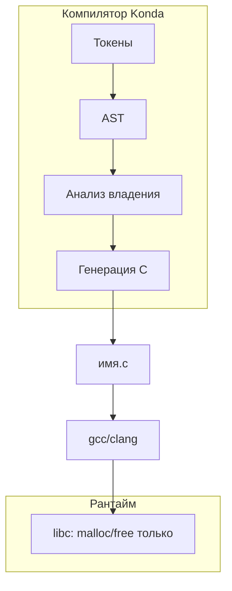

# Архитектура транспилятора Konda → C

Документ описывает **целевую** архитектуру: как развить текущий транспилятор до генератора обычного C **без собственной рантайм-библиотеки**, где освобождение памяти, «подсчёт ссылок» и проверки границ массивов выполняются **на этапе компиляции** и выражаются явными вызовами `malloc` / `free` и условиями в сгенерированном коде.

> **Где мы сейчас.** Уже есть рабочий **однопроходный** транспилятор (`транспиляция.c`): он идёт по массиву токенов и сразу печатает C, **без построения AST**. Этим уже достигнута цель Этапа A (`тест.конда` → `.c` → бинарник через `cc`), а также частичная проверка границ массивов на этапе компиляции (см. `ТРАНСПИЛЯЦИЯ.md`). Описанные ниже AST, семантика и анализ владения — это следующие этапы, которых в коде **ещё нет**.

---

## 1. Цели и ограничения

| Цель | Как достигается |
|------|-----------------|
| Autofree | Вставка `free` / освобождающих действий на всех выходах из области видимости |
| Нет утечек | Статический учёт владения; ошибка компиляции при неоднозначном владении |
| Проверка границ массивов | Обёртка массива + проверка индекса перед каждым доступом |
| Без рантайма | Нет `.a` / `.so`, нет глобального аллокатора, нет полей `refcount` в heap-объектах |
| «Подсчёт ссылок» | Анализ графа использований; компилятор знает **сколько раз** значение живёт и **куда** вставить копию или `free` |

Важно: речь не о динамическом reference counting в рантайме (как в Python или `shared_ptr` с атомиками), а о **статическом владении** (ownership), по смыслу близком к Rust, но с генерацией в C.

---

## 2. Конвейер (после токенизации)

Сейчас генерация идёт прямым проходом по токенам в `транспиляция.c`, без AST. Целевой порядок проходов:

```
исходник (.конда)
    → [готово] Лексер / токенизатор (МассивТокенов)
    → Синтаксический анализ (рекурсивный спуск / Pratt) → AST
    → Семантика: типы, области, владение, размеры массивов
    → (опционально) упрощённый IR для анализа путей и владения
    → Генерация C + карта имён (кириллица → ASCII для C)
    → gcc/clang
```

Рекомендуемые модули в репозитории (логически, не обязательно отдельные файлы сразу):

- `разбор.c` — парсер, построение AST
- `семантика.c` — таблица символов, проверки типов и владения
- `владение.c` — граф использований, autofree, статический «refcount»
- `кодоген.c` — печать `.c` / `.h`
- `конвейер.c` — оркестрация и диагностики

Сейчас `конвейер.c` содержит только отладочную склейку токенов (`конвертация_базовая`) и `очистка`; отдельного парсера в AST ещё нет — его место в цепочке: **токены → AST**, без генерации текста на этом шаге. Существующий `транспиляция.c` совмещает разбор и генерацию в один проход и в целевой архитектуре разделяется на `разбор.c` + `кодоген.c`.

---

## 3. Модель памяти в языке

Чтобы компилятор мог доказать отсутствие утечек **без рантайма**, в Konda нужно явно разделить категории значений.

### 3.1. Категории

1. **Стек / примитивы** — `целое4`, `символ`, структуры без указателей на кучу: живут в области видимости, в C — локальные переменные.
2. **Уникальная куча (`владеет`)** — один владелец; при присваивании владение **перемещается** (move), старый путь становится недействительным.
3. **Заимствование (`&`)** — временная ссылка без передачи владения; не продлевается за пределы владельца (как в Rust, без полноценного borrow checker на первом этапе можно ограничить: «ссылка не переживает блок, где объявлен владелец»).
4. **Совместное использование без RC** — только если компилятор **статически** видит ровно N копий указателя с известным временем жизни; тогда вместо счётчика в памяти — **N явных `free`** в известных точках или **ровно одна** копия данных (остальное — заимствование).

На первом этапе проще всего: **только уникальное владение + заимствование**. Любая «вторая владельца» копия — либо явный `клон(...)` (глубокая копия + новый владелец), либо ошибка компиляции.

### 3.2. Что такое «статический подсчёт ссылок»

Компилятор для каждого значения с динамической памятью строит:

- **владелец** — переменная/поле, которая обязана вызвать освобождение;
- **число путей** — сколько раз значение передаётся (move / clone / borrow);
- **точки drop** — конец блока, `return`, `break`, `continue`, все ветки `если`.

«Счётчик ссылок» здесь — **целое в анализе компилятора**, не поле в структуре:

```
владеет строка* s = выделить(...);   // strong = 1
владеет строка* t = s;               // move: s недействителен, t strong = 1
клон(u, t);                          // t = 1, u = 1 (два владельца → два free в разных scope)
```

Если после анализа `strong > 1` без явного `клон` — **ошибка**: «значение используется после передачи владения» или «неоднозначное владение».

---

## 4. Autofree (RAII на этапе codegen)

### 4.1. Правило

Для каждой переменной с ресурсом компилятор регистрирует **destructor** (что вызвать при drop):

| Тип в Konda | Действие при drop |
|-------------|-------------------|
| `владеет T*` | `free(ptr)` или `free(ptr); free(wrapper)` |
| массив `владеет` | `free(данные)` |
| файл / сокет (если появятся) | `fclose` / `close` |

Вставка в C — в **все** точки выхода из scope:

- перед закрывающей `}` блока;
- перед каждым `return` с очисткой только **живых** в этой ветке переменных;
- в ветках `если` / `пока` — те же правила внутри вложенных блоков.

Порядок drop — **обратный** порядку объявления (как в C++ destructors).

### 4.2. Пример генерируемого C

Konda:

```конда
{
    владеет целое4* p = выделить(размер * sizeof(целое4));
    // ... использование ...
}
```

C:

```c
int32_t *p = (int32_t*)malloc((size_t)n * sizeof(int32_t));
if (!p) { /* обработка OOM по политике языка */ }
/* ... */
free(p);
```

При нескольких выходах:

```c
int32_t *p = malloc(...);
if (условие) {
    free(p);
    return 1;
}
free(p);
```

Компилятор **не** полагается на `atexit` и не генерирует общий `konda_drop_all()` — только локальные, предсказуемые вызовы.

### 4.3. Move и недействительные переменные

После `владеет B = A` (move) в анализе `A` помечается **moved**. Любое использование `A` — ошибка. В C генерируется присваивание указателя и **обнуление** или отдельный флаг не нужен, если move реализован как:

```c
b = a;
a = NULL;  /* опционально, для отладочных assert */
```

Drop для `a` не вставляется (владение ушло), drop для `b` — в конце scope.

---

## 5. Массивы и проверка границ

### 5.1. Представление в Konda и в C

Не генерировать «голый» `T[]` без длины. Внутреннее представление:

```c
typedef struct {
    int32_t *данные;
    size_t длина;
} Konda_Срез_целое4;
```

Для статически известной длины можно оптимизировать до `T arr[N]` **только** если анализ доказал, что индексы всегда `< N`, иначе — срез с `длина`.

### 5.2. Операции

| Операция | Генерация |
|----------|-----------|
| `a[i]` чтение | `konda_bounds_check(a.длина, i); a.данные[i]` |
| `a[i] = x` | то же |
| `длина(a)` | `a.длина` |

`konda_bounds_check` — **не** рантайм-библиотека, а **макрос или static inline** в сгенерированном заголовке одного файла (или встроенный `if` в каждую точку доступа):

```c
static inline void konda_bounds_check(size_t len, ptrdiff_t i) {
    if ((size_t)i >= len) {
        fprintf(stderr, "индекс %td вне [0, %zu)\n", i, len);
        abort();
    }
}
```

Политика ошибки: `abort()`, `exit(1)` или `__builtin_trap()` — на выбор, без аллокатора.

### 5.3. Константные индексы

Если `i` — литерал и известна `длина` при компиляции Konda, проверку можно **не генерировать** (оптимизация в pass «constant folding»).

### 5.4. Итерация

Цикл `для (i : a)` генерирует обход `0 .. a.длина-1` без пользовательского индекса — границы соблюдены по конструкции.

---

## 6. Семантический анализ (минимум для памяти и границ)

### 6.1. Таблица символов

- Области: файл, функция, блок.
- Поля: тип, `владеет` / `заимствование`, moved?, строка объявления.

### 6.2. Проверки типов

- Совместимость в `=`, вызовах, `если`.
- `размер_обьекта(x)` → `sizeof` в C только для допустимых типов.

### 6.3. Анализ владения (ядро autofree)

Алгоритм на AST (упрощённо):

1. При объявлении `владеет x = expr` — владение 1 на `x`.
2. Присваивание `x = expr`:
   - drop старого значения `x` (если было владеет);
   - новое владение на `x`.
3. Вызов функции: параметры по правилам (`владеет` → move в формальный параметр, drop в конце функции для формальных `владеет`).
4. `return expr` — move владения наружу или drop локальных.
5. Ветвление: merge состояний **осторожно**; если в одной ветке move, в другой нет — либо ошибка, либо обязательный drop в каждой ветке до merge.

Диагностики на русском, с привязкой к `строка` / `позиция_в_строке` из `Токен`.

### 6.4. Функции и границы

Сигнатуры:

```конда
владеет Срез_целое4 создать_массив(целое4 n);
```

Возврат `владеет` — вызывающий обязан поглотить владение (иначе предупреждение «значение не использовано» → утечка → ошибка).

---

## 7. Генерация C

### 7.1. Имена

C не обязан понимать кириллицу в идентификаторах (зависит от компилятора). Надёжно: **внутренний ASCII** (`_konda_main`, `_konda_x_3`) + комментарий с исходным именем.

Таблица: `идентификатор Konda → уникальный C-символ` на единицу компиляции.

### 7.2. Заголовок сгенерированного файла

```c
/* Сгенерировано Konda. Не редактировать. */
#include <stdint.h>
#include <stddef.h>
#include <stdlib.h>
#include <stdio.h>

/* bounds + типы срезов — static inline в этом файле, не линкуется отдельно */
```

Пользовательские `#содержит` из исходника (как в `тест.конда`) копируются в начало.

### 7.3. Точка входа

`тест.конда`: `целое4 точка_входа(...)` → `int32_t main(int32_t argc, char **argv)` с маппингом `количество_аргументов` на `argc` и `аргументы` на `argv` (уже реализовано в `транспиляция.c`).

---

## 8. Поэтапная реализация

### Этап A — AST и печать «тупого» C

- Парсер объявлений, `если`, выражений, блоков.
- Кодоген без владения: всё как в C, ручной `free`.
- Цель: прогнать `тест.конда` через компилятор C.

> Цель этапа A (прогон `тест.конда` через C-компилятор) уже достигнута однопроходным `транспиляция.c`, но **без AST** — AST остаётся задачей этого этапа, чтобы разделить разбор и кодоген.

### Этап B — срезы и bounds

- Тип массива как `{ данные, длина }`.
- Inline-проверки на `[]`.
- Константное схлопывание проверок.

### Этап C — `владеет` и move

- Запрет use-after-move.
- Autofree на концах блоков и `return`.

### Этап D — `клон` и статический «multi-owner»

- Явное размножение владения только через `клон`.
- Компилятор выставляет два независимых drop.

### Этап E — оптимизации

- Удаление лишних `konda_bounds_check`.
- Стековые массивы при доказуемых границах.
- Объединение последовательных `free`/`malloc` (редко, осторожно).

---

## 9. Структуры данных компилятора

```text
AST узел: тип, дети, ссылка на токен (строка, позиция)
Символ:   имя, тип, вид (владеет/заимств/стек), состояние (жив/moved)
Функция:  формальные параметры + граф drop в конце
Codegen:    буфер строк (как сейчас в конвертация_базовая, но по AST)
```

Для AST удобен enum узлов: `УЗЕЛ_БЛОК`, `УЗЕЛ_ЕСЛИ`, `УЗЕЛ_ОБЪЯВЛЕНИЕ`, `УЗЕЛ_ДОСТУП_МАССИВ`, `УЗЕЛ_ВЫЗОВ`, …

---

## 10. Ограничения модели (честно заранее)

Без рантайма **невозможно**:

- произвольное количество владельцев, известное только в рантайме;
- замыкания, удерживающие `владеет` дольше stack frame, без явного `клон` или arena;
- безопасный `realloc` при активных ссылках на старый буфер — нужен move в новый `владеет` буфер.

Статический анализ требует от программиста (или синтаксиса) дисциплины: **move по умолчанию**, **клон явно**.

---

## 11. Связь с текущим кодом

| Файл | Роль сейчас | Роль в целевой архитектуре |
|------|-------------|----------------------------|
| `токенизатор_лексер.c` | Лексер | Без изменений концепции |
| `массив_токенов.c` | Хранение токенов | Без изменений |
| `транспиляция.c` | Однопроходный разбор + кодоген (токены → `.c`) | Разделяется на `разбор.c` (→ AST) и `кодоген.c` (← AST) |
| `основа.c` | CLI: `.конда` → `.c` → бинарник | Вызов: parse → sema → codegen → запись `.c` → `cc` |
| `конвейер.c` / `конвертация_базовая` | Отладочная склейка токенов | Заменяется/дополняется `кодоген` по AST |

---

## 12. Критерии готовности

1. Программа с только `владеет` и без утечек компилируется в C, `valgrind` на сгенерированном файле — **0 leaks** (допустим still reachable от libc).
2. Выход за границу массива в тесте — предсказуемый `abort` с сообщением, без UB.
3. Use-after-move — ошибка Konda, не сгенерированный C.
4. В сгенерированном `.c` нет неразрешённых символов кроме libc и пользовательских `#содержит`.

---

## 13. Краткая схема владения



Итог: **autofree** = корректно расставленные `free` и аналоги; **границы** = срез + проверка; **нет утечек** = строгое владение; **нет рантайма Konda** = только статический анализ и inline-помощники в одном сгенерированном файле.
