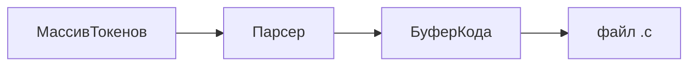

# Модуль `транспиляция.c`

Документ описывает текущую реализацию транспиляции Konda → C: как устроен парсер, что уже переводится в C и как работают проверки на этапе компиляции.

---

## Место в конвейере

```
файл .конда
    → токенизатор (токенизатор_лексер.c)
    → транспилировать_в_си()   ← этот модуль
    → файл .c
    → скомпилировать_си()      ← вызов cc
    → исполняемый файл
```

Точка входа пользовательской программы — **`основа.c`**: он читает `.конда`, вызывает `транспилировать_в_си`, затем `скомпилировать_си`.

Публичный API объявлен в `транспилятор.h`:

| Функция | Назначение |
|---------|------------|
| `транспилировать_в_си(токены, путь_исходника, путь_выходного_си)` | разбор токенов и запись `.c` |
| `скомпилировать_си(путь_си, путь_исполняемого)` | сборка через `cc` (получается `<имя>.elf`) |

---

## Общая схема работы

`транспиляция.c` не строит отдельное AST-дерево. Это **однопроходный рекурсивный спуск** по массиву токенов с **немедленной генерацией C** в буфер строк.



Центральная структура — **`Парсер`**:

| Поле | Роль |
|------|------|
| `токены`, `позиция` | входной поток и текущий индекс |
| `код` | накапливаемый текст C |
| `ошибка`, `сообщение`, `строка_ошибки`, `колонка_ошибки` | диагностика (позиция берётся из токена; колонка — по символам UTF-8) |
| `в_точке_входа` | флаг: сейчас разбирается `точка_входа` |
| `связи[]` | пары «массив ↔ переменная длины» |
| `ограничения[]` | стек известных минимальных длин в ветках `если` |

---

## Точка входа программы: `точка_входа` → `main`

В языке Konda **единственная точка входа исполняемой программы** — функция с именем **`точка_входа`**. Транспилятор **всегда** переводит её в стандартную **`main`** C.

Это не опция и не эвристика по имени файла: если в объявлении функции идентификатор равен `точка_входа`, генерируется `main`.

### Konda

```конда
целое4 точка_входа(целое4 количество_аргументов, символ** аргументы)
{
    ...
}
```

### Сгенерированный C

```c
int32_t main(int32_t argc, char **argv)
{
    ...
    return 0;
}
```

### Правила преобразования

| Konda | C | Примечание |
|-------|---|------------|
| `точка_входа` | `main` | имя функции в C |
| `целое4` (тип возврата) | `int32_t` | |
| `количество_аргументов` | `argc` | только внутри `точка_входа` |
| `аргументы` | `argv` | только внутри `точка_входа` |
| параметры в скобках Konda | `(int32_t argc, char **argv)` | исходная сигнатура в Konda **игнорируется**, подставляется стандартная для C |

Реализация — функции `сгенерировать_функцию` и `имя_в_си`:

- при разборе `точка_входа` выставляется `ps->в_точке_входа = 1`;
- в C печатается `main`, а не кириллическое имя;
- параметры из исходника пропускаются, вместо них вставляется `int32_t argc, char **argv`;
- в конце тела автоматически добавляется `return 0;`.

Остальные функции (не `точка_входа`) транслируются с сохранением имени как в UTF-8 и с переводом списка параметров: тип каждого параметра отображается в C-тип, поддерживаются `*` и `[]` в типе, имя параметра копируется как есть. В конце тела любой функции (не только `точка_входа`) сейчас тоже добавляется `return 0;`.

---

## Проверка границ массивов (compile-time)

Проверки **не** попадают в сгенерированный C как `if` в рантайме. Транспилятор отклоняет программу **до** записи `.c`, если индекс не доказуемо безопасен.

### Связь массива и длины

Для `точка_входа` регистрируется связь:

```
аргументы  ↔  количество_аргументов
```

(в C: `argv` ↔ `argc`).

### Условия в `если`

Если условие имеет вид сравнения с числом:

| Konda | Минимальная длина для переменной |
|-------|----------------------------------|
| `x > N` | `N + 1` |
| `x >= N` | `N` |

`>=` принимается как одним токеном (`>=`), так и в виде `=>` (`=` затем `>`).

Пример: `если (количество_аргументов > 1)` → в этой ветке длина `аргументов` не меньше **2**, значит индекс **`1`** допустим.

### Доступ по индексу

Поддерживаются только **числовые литералы** в `[]`, например `аргументы[1]`.

Перед генерацией C вызывается `проверить_доступ_к_массиву`:

- если длина неизвестна → ошибка транспиляции;
- если `индекс >= минимальная_длина` или `индекс < 0` → ошибка с номером строки и колонки.

Пример ошибки:

```
Ошибка транспиляции (строка 6, колонка 26): индекс 1 вне границ: при текущих условиях длина не меньше 1
```

(возникает при `> 0` вместо `> 1` для доступа к `аргументы[1]`).

### Ветка `иначе`

При входе в `иначе` ограничения из ветки `если` **сбрасываются**. В `else` нельзя полагаться на минимальную длину, выведенную в `then`.

---

## Поддерживаемый синтаксис (сейчас)

### Верхний уровень файла

1. Директива `#содержит ...` → `#include ...` (`содержит` заменяется на `include`).
2. Объявление функции, начинающееся с любого примитивного типа (`целое4`, `целое8`, `байт`, `вещественное`, `символ`).

Комментарии и пустые строки пропускаются.

### Внутри функции

| Konda | C |
|-------|---|
| `если (условие) { ... }` | `if (условие) { ... }` |
| `иначе { ... }` | `else { ... }` |
| `целое4 имя = выражение;` | `int32_t имя = выражение;` |
| `printf(...);` | `printf(...);` — аргументы передаются как есть, формат-строку задаёт сам пользователь |
| вызов `имя(...);` | тот же вызов в C |

`printf` не обрабатывается особым образом: это обычный вызов функции. Перевод строки и спецификаторы (`%s`, `%d`, …) указываются в исходнике Konda, например `printf("%d\n", икс);`.

### Типы

| Konda (ключевое слово) | C | Токен |
|------------------------|---|-------|
| `целое4` | `int32_t` | `ТОКЕН_ЦЕЛОЕ4` |
| `целое8` | `int64_t` | `ТОКЕН_ЦЕЛОЕ8` |
| `байт` | `uint8_t` | `ТОКЕН_БАЙТ` |
| `вещественное` | `float` | `ТОКЕН_ВЕЩЕСТВЕННОЕ` |
| `символ` | `char` | `ТОКЕН_ТИП_СИМВОЛ` |

Примитивы — **отдельные ключевые слова** в лексере, не `ТОКЕН_ИДЕНТИФИКАТОР`. Им нельзя назначить переменную с тем же именем.

Лексер также распознаёт ключевые слова `целое1` (`ТОКЕН_ЦЕЛОЕ1`), `целое2` (`ТОКЕН_ЦЕЛОЕ2`) и `неподписанный` (`ТОКЕН_НЕПОДПИСАННЫЙ`), но кодоген их пока **не обрабатывает** (`токен_это_тип` и `тип_токена_в_си` их не учитывают) — использовать как типы нельзя.

| Konda | C | Токен |
|-------|---|-------|
| `точка_входа` | `main` | `ТОКЕН_ТОЧКА_ВХОДА` |

### Выражения

- идентификаторы, числа, строки;
- вызовы функций;
- доступ к массиву `a[N]` (с проверкой границ);
- скобки;
- бинарные операторы: `+`, `-`, `*`, `/`, `>`, `<`, `=` (как в исходнике).

---

## Структура функций модуля

```
транспилировать_в_си()
    └── сгенерировать_программу()
            ├── сгенерировать_препроцессор()   # #содержит
            └── сгенерировать_функцию()
                    └── сгенерировать_блок()
                            └── сгенерировать_оператор()
                                    ├── сгенерировать_если()
                                    │       └── сгенерировать_условие_если()
                                    ├── сгенерировать_объявление()
                                    └── сгенерировать_вызов()
                                            └── сгенерировать_выражение()
                                                    └── сгенерировать_первичное()
```

### Вспомогательные группы

**Лексер поверх токенов**

- `пропустить_служебные` — пропуск комментариев и `\n`
- `текущий`, `съесть` — чтение потока
- `идентификатор_равен`, `срез_равен` — сравнение UTF-8 идентификаторов

**Кодоген**

- `буфер_добавить`, `буфер_добавить_отрезок` — рост буфера C
- `имя_в_си`, `тип_токена_в_си` — таблица имён и типов Konda → C

**Анализ длин**

- `ограничения_сохранить` / `ограничения_восстановить` — стек веток
- `ограничение_установить` — запись минимума из `если`
- `проверить_доступ_к_массиву` — финальная проверка индекса

---

## Заголовок сгенерированного файла

Каждый `.c` начинается с:

```c
/* Сгенерировано транспилятором Konda */
#include <stdint.h>
```

Директивы `#содержит` из исходника добавляются следом (например `#include <stdio.h>`).

---

## Сборка результата

`скомпилировать_си` выполняет:

```bash
cc -std=gnu23 -Wall -Wextra -O2 -o "вывод/<имя>.elf" "вывод/<имя>.c"
```

Имя берётся из входного файла без расширения. Все артефакты складываются в папку **`вывод/`** (создаётся автоматически в `основа.c` через `mkdir`), а к исполняемому добавляется суффикс `.elf`. Например `тест.конда` → `вывод/тест.c` и `./вывод/тест.elf`. Корень проекта при этом не засоряется; папка `вывод/` добавлена в `.gitignore`.

---

## Пример: `тест.конда`

**Исходник:**

```конда
#содержит <stdio.h>

целое4 точка_входа(целое4 количество_аргументов, символ** аргументы)
{
    если (количество_аргументов > 1) {
        printf(аргументы[1]);
    } иначе {
        printf("аргументов нет");
    }
    целое4 икс = 25;
    целое4 y = 5;

    printf("%d\n",икс+y);
}
```

**Результат (`вывод/тест.c`):**

```c
/* Сгенерировано транспилятором Konda */
#include <stdint.h>
#include <stdio.h>
int32_t main(int32_t argc, char **argv)
{
    if (argc > 1) {
        printf(argv[1]);
    } else {
        printf("аргументов нет");
    }
    int32_t икс = 25;
    int32_t y = 5;
    printf("%d\n",икс+y);
    return 0;
}
```

Формат-строки (`%s`, `%d`) и переводы строк берутся прямо из исходника — транспилятор их не добавляет.

**Запуск:**

```bash
./Собранное/Транспилятор тест.конда
./вывод/тест.elf           # → аргументов нет30
./вывод/тест.elf hello     # → hello30
```

---

## Ограничения текущей версии

- Одна программа = один `.конда`-файл, без модулей.
- Нет autofree / `владеет` — только статическая проверка индексов.
- `printf` транслируется как обычный вызов: формат-строка и `\n` — на стороне исходника, транспилятор их не подставляет.
- Индекс массива — только литерал, не переменная.
- Проверка границ работает только там, где длина выведена из `если (длина > N)` / `>= N`.
- В конце тела любой функции в C всегда добавляется `return 0`; явный `return` в Konda пока не поддерживается.
- Другие функции кроме `точка_входа` транслируются с переводом параметров, но без проверки типов и без анализа тела сверх общих правил.

---

## Связанные файлы

| Файл | Роль |
|------|------|
| `транспиляция.c` | парсер и кодоген |
| `транспилятор.h` | API и типы токенов |
| `токенизатор_лексер.c` | лексический анализ |
| `основа.c` | CLI: `.конда` → `.c` → бинарник |
| `АРХИТЕКТУРА_ТРАНСПИЛЯТОРА.md` | целевая архитектура (autofree, владение, срезы) |
